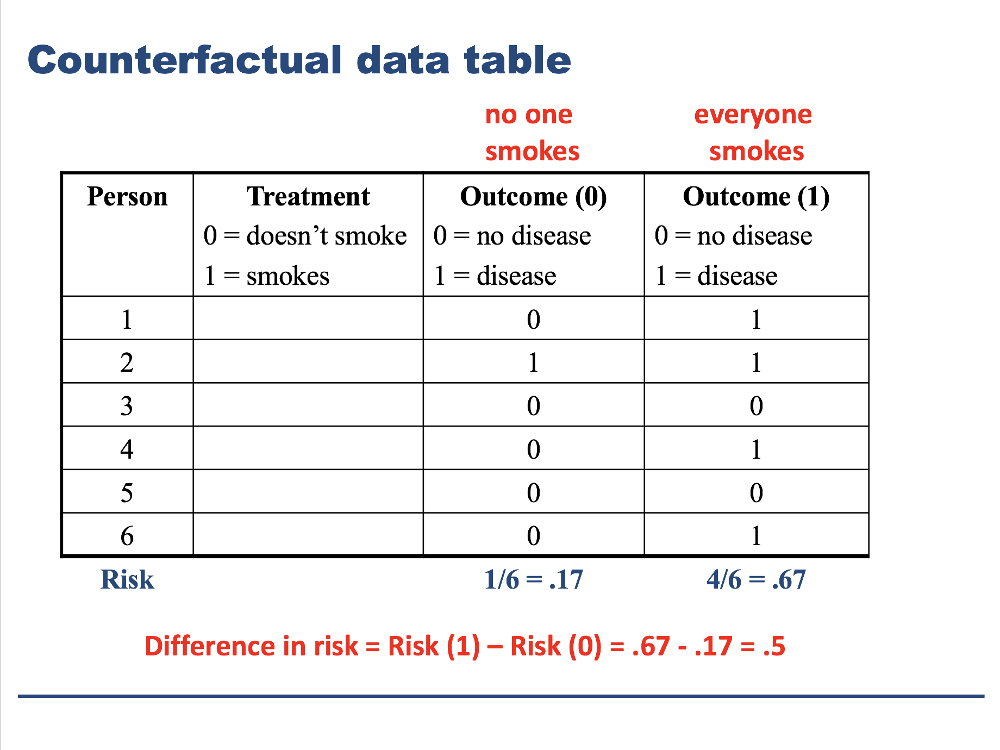
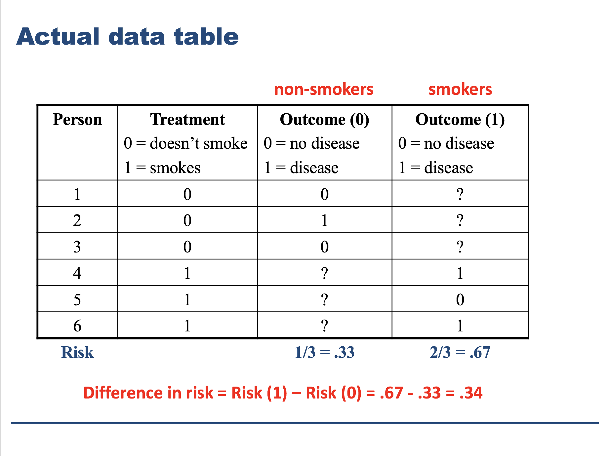
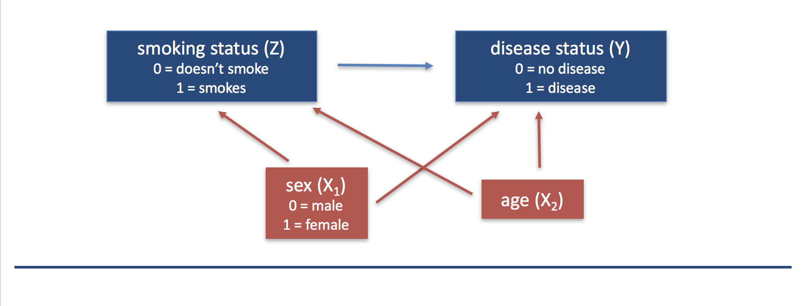

```{r setup, include=FALSE}
knitr::opts_chunk$set(echo = TRUE)
knitr::opts_knit$set(root.dir = "/cloud/project")
```

## Course information

**Objective:** To enable each student to enhance his/her quantitative, scientific reasoning and to achieve a functional standard in statistical data analysis using the `R` statistical language.

**Modular Organization:** 

* Module 1: Risk of smoking-caused disease (LC, CVD, etc), the contribution of smoking, and possible effect modification by sex and socio-economic status (SES)
* Module 2: TBD
* Module 3: Individual projects!

**Computation:** Statistical software R

* Bring your laptop to each course meeting
* We will work with R through the RStudio Cloud interface ([https://rstudio.cloud/](https://rstudio.cloud/))
* You will create all of your assignments using R Markdown
* You are encouraged to complete online tutorials on using R through RStudio Cloud ("Learn" --> "Primers" in the left-hand menu)
* Another great resource for learning R is the online book "R for Data Science", which you can access for free at [https://r4ds.had.co.nz/](https://r4ds.had.co.nz/)

**Version control/collaboration**: GitHub

* GitHub is an online compendium of file repositories where people can share their work, work collaboratively with others, and easily use a version control sustem to track development of software and projects
* We will share course materials and assignments through Github
* You will turn in your work through GitHub
* You will collaborate with your teams using Github

**Class structure:**

* We will usually start class by sharing YOUR work that has been done in the previous week
* We will ask that you turn in your work to us (pushed to GitHub) by Sunday night at midnight so we can prepare for Monday's class
* Everyone should be prepared to talk about their work and provide constructive feedback to their classmates each week

**Communicating with instructors:**

* If you need to email us about a course-related matter: phbiostats@jhu.edu
* This account is accessed by both Dr. Jager and Dr. Taub
* Emails to our individual accounts about a course-related matter will NOT receive a reply
* If asking a question about code or other work for an assignment, please also copy Grant (gschumo1@jhu.edu) on your email as well.

**Syllabus:** You should read the entire syllabus and let us know if you have any questions or concerns.

## Module 1: Smoking and the risk of disease

Questions of interest:

* *Question 1.1:* How does the risk of disease compare for smokers and otherwise similar non-smokers?

* *Queston 1.2:* Does the contribution of smoking to the risk of disease vary by sex or socio-economic status (SES)?

To address each question we want:

* A data display (graph or table)
* A statistical analysis (with interprepration)

We will answer these questions using data from the National Medical Expenditures Survey (NMES)

## NMES data

Let's take a look at the NMES data.  This data is stored in the file `nmesUNPROC.csv` in the same Module1 folder that includes this .Rmd file.

We will read the data into R using the `read_csv()` function from the `readr` package.  This `readr` package is part of a core group of packages called the `tidyverse`.  In order to use a package in R, you must first install the package (once) and then load the package (each time you are in a new session of R).  We will often be working with the tidyverse packages in the course, so we have already installed these packages in our shared RStudio cloud workspace.  We still need to load these packages each time we are going to use them in an R session.  We can load all of the course tidyverse packages at once like this:
```{r}
library(tidyverse)
```

Now we can read the data into R:
```{r}
nmes_data <- read_csv("./Module1/nmesUNPROC.csv")
```

Since the the default working directory (where R looks for files) is the project directory, we need to tell R where to find this data file.  In the path above, the `.` represents the working directory and then we tell R to look in the `Module1` folder and then give it the file name.

Here we can get an idea of the variables in this NMES dataset.  Here is a codebook for these variables:

* `age`: age in years
* `female`: 1=female, 0=male
* `eversmk`: 1=has ever been a smoker, 0=has never been a smoker
* `current`: 1=current smoker, 0=not current smoker
* `former`: 1=former smoker, 0=not former smoker, NA if eversmk=0
* `packyears`: reported packs per year of smoking (0 if eversmk = No
* `yearsince`: years since quitting smoking (0 if eversmk = No)
* `totalexp`: self-reported total medical expenditures for 1987
* `lc5`: 1=Lung Cancer, Laryngeal Cancer or COPD, 0=none of these
* `chd5`: 1=CHD, Stroke, and other cancers (oral, esophageal, stomach, kidney and bladder), 0=none of these
* `beltuse`: 1=Rare, 2=Some, 3=Always/Almost always
* `educate`: 1=College grad, 2=Some college, 3=HS grad, 4=other
* `marital`: 1=Married, 2=widowed, 3=divorced, 4=separated, 5=never married
* `poor`: 1=Poor, 0=Not poor

We can peek at the data itself in a couple of ways:

* The `glimpse()` function shows us the first few values of each variable:
```{r}
glimpse(nmes_data)
```

* The `head()` functions shows us the first few rows of the dataset:
```{r}
head(nmes_data)
```
Notice that this display is optimized to fit our display screen, and we only see the variables that will nicely fit in the display.  This is because our data is stored as a tibble, which is a particular way to display a data set.  Change the dimensions of your console window and re-run this command to see what happens!  If we want to force R to show us all rows, we can force our data to be a data frame instead of a tibble:
```{r}
head(as.data.frame(nmes_data))
```

* If we just want a list of the names of the variables in the data set, we can use the `names()` function:
```{r}
names(nmes_data)
```

## Question 1.1: How does the risk of disease compare for smokers and otherwise similar non-smokers?

To answer this question, we might start by making some displays of our data. 

**First, suppose we wanted simply wanted to compare the risk of disease between smokers and non-smokers.**  We could display this comparison in either a table or a graph.

### Bar graphs

First let's consider some graphs.  What does each graph show us?  Which graphs help us compare the risk of disease between smokers and non-smokers?

```{r}
ggplot(data = nmes_data) + 
  geom_bar(mapping = aes(x = eversmk))
```

```{r}
ggplot(data = nmes_data) + 
  geom_bar(mapping = aes(x = eversmk, y = stat(prop)))
```

```{r}
ggplot(data = nmes_data) + 
  geom_bar(mapping = aes(x = lc5))
```

```{r}
ggplot(data = nmes_data) + 
  geom_bar(mapping = aes(x = lc5, y = stat(prop)))
```

It might be helpful if we re-code the values of 0 and 1 to be more meaningful labels.  We can do this by turning these two numeric variables into factor variables with meaningful labels:

```{r}
nmes_data <- nmes_data %>%
  mutate(eversmk = factor(eversmk, levels = c("0", "1"), labels = c("Never smoker", "Ever smoker")),
         lc5 = factor(lc5, levels = c("0", "1"), labels = c("No LC", "LC"))
         )
```

Let's look at one of our proportion plots again:
```{r}
ggplot(data = nmes_data) + 
  geom_bar(mapping = aes(x = eversmk, y = stat(prop)))
```

Both of the proportions are 1?!  This is because now that our variable is a factor variable, we also have to specify which groups we want to calculate the proportions relative to. If we want the proportions overall, we use `group = 1`:
```{r}
ggplot(data = nmes_data) + 
  geom_bar(mapping = aes(x = eversmk, y = stat(prop), group = 1))
```

```{r}
ggplot(data = nmes_data) + 
  geom_bar(mapping = aes(x = lc5, y = stat(prop), group = 1))
```

We've made these plots look nicer, but are they helping us to answer our question? How can we include both variables together in the same graph?  We can do this by mapping the second variable to `fill` in our graph:

```{r}
ggplot(data = nmes_data) + 
  geom_bar(mapping = aes(x = lc5, fill = eversmk))
```

We can make this look even nicer by adjusting the position of the bars.  We can place them next to each other with `position = "dodge"`:

```{r}
ggplot(data = nmes_data) + 
  geom_bar(mapping = aes(x = lc5, y = stat(prop), fill = eversmk), position = "dodge")

ggplot(data = nmes_data) + 
  geom_bar(mapping = aes(x = lc5, y = stat(prop), group = eversmk, fill = eversmk), position = "dodge")
```

Or we can stack them as proportions with `position = "fill"`:

```{r}
ggplot(data = nmes_data) + 
  geom_bar(mapping = aes(x = lc5, fill = eversmk), position = "fill")
```

Now we have the graphs with both the `lc5` and `eversmk` variables.  Can we now compare the risk of disease between smokers and non-smokers?

Let's make one more change:
```{r}
ggplot(data = nmes_data) + 
  geom_bar(mapping = aes(x = eversmk, fill = lc5), position = "fill")
```

Now, how would you say that this risk of disease compare for smokers and non-smokers?

### Tables

We could also look at these relationships using tables:
```{r}
nmes_data %>%
  count(eversmk)

nmes_data %>%
  count(lc5)

nmes_data %>%
  count(lc5, eversmk)

nmes_data %>%
  count(eversmk, lc5)
```

Do these tables help us compare the risk of disease for smokers and non-smokers?

To get proportions instead of counts, we can mutate our table to add a proportions column, defined as the value in the `n` column divided by the sum of the values in the `n` column.  Basically we are specifying a new column `prop = n/sum(n)`:
```{r}
nmes_data %>%
  count(eversmk) %>%
  mutate(prop = n/sum(n))
```

Let's do this for all of our tables:
```{r}
nmes_data %>%
  count(eversmk) %>%
  mutate(prop = n/sum(n))

nmes_data %>%
  count(lc5) %>%
  mutate(prop = n/sum(n))

nmes_data %>%
  count(lc5, eversmk) %>%
  mutate(prop = n/sum(n))

nmes_data %>%
  count(eversmk, lc5) %>%
  mutate(prop = n/sum(n))
```

Do these new tables allow us to compare the risk of disease for smokers and non-smokers?  

What we really want is a table where the proportions add up to 1 within the smoking groups, not across all four of the groups.  We can do this by using the `group_by()` option.  If we group by `lc5`, then our proportions add up to 1 within the LC groups.  If we group by `eversmk`, then our proportions add up to 1 within the smoking groups:
```{r}
nmes_data %>%
  count(lc5, eversmk) %>%
  mutate(prop = n/sum(n))

nmes_data %>%
  count(lc5, eversmk) %>%
  group_by(lc5) %>%
  mutate(prop = n/sum(n))

nmes_data %>%
  count(lc5, eversmk) %>%
  group_by(eversmk) %>%
  mutate(prop = n/sum(n))
```

Which one of these is the one we want if our goal is to compare the risk of disease between smokers and non-smokers?

Note: we can make our tables prettier by using the `kable()` function from the `knitr` package.  Again we have already installed the `knitr` package in our shared workspace, so we only have to load it before we can use it:
```{r}
library(knitr)

nmes_data %>%
  count(lc5, eversmk) %>%
  group_by(eversmk) %>%
  mutate(prop = n/sum(n)) %>%
  kable()

nmes_data %>%
  count(lc5, eversmk) %>%
  group_by(eversmk) %>%
  mutate(prop = n/sum(n)) %>%
  kable(digits = 3)
```

## Now about the "otherwise similar" part!

We have made some data displays that allow us to compare the risk of disease between smokers and non-smokers.  But we really want to compare the risk of disease between smokers and **otherwise similar** non-smokers.

What do we mean by this?

Think about it this way -- if our goal is to try to determine whether smoking *causes* disease, we need to think about what we mean by the work "cause."

In Public Health Biostatistics, we used the **counterfactual** definition of a "causal effect" of "treatment":

> A "causal effect" is the difference (or other comparison) between a population characteristic (e.g. mean, risk) having given the treatment to everyone and the same population characteristic absent the treatment

In our case, we have:

* Treatment = smoking
* Population characteristic = risk of disease
* We want to compare the risk of disease between two worlds where (1) everyone smokes and (2) no one smokes

If we could observe a world where everyone smokes **and** a world where no one smokes, we would observe the following data:


If we could observe each person both as a smoker and a non-smoker, we could directly see the effect of smoking on disease, because the only thing different between the two worlds would be that the person smoked or not.

However, we can't observe each person as both a smoker and a non-smoker, so the data we really observe is this:


Here we still observe a difference in disease risk between the smokers and the non-smokers, but we can't be certain that the difference is due to smoking because there may be other differences between the smokers and non-smokers besides smoking status.  Perhaps, for example, all the non-smokers are female while the smokers are male.  Or perhaps the smokers tend to be older than the non-smokers.  There is the potential that other variables could **confound** the relationship between smoking and disease.

> There is **confounding** in the effect of a treatment $Z$ (e.g. smoking) on an outcome variable $Y$ (e.g. disease status) if we fail to compare **otherwise similar** unites and as a result attribute to $Z$ what is **actually caused by factors $X$** that differ between the $Z=0$ and $Z=1$ observations.

We often display this confounding using a directed acyclic graph (DAG):


This is why it's not enough just to compare the risk of disease between smokers and non-smokers.  We need to compare the risk of disease between smokers and **otherwise similar** non-smokers.  

## Assignment 1.1

Create a data display with the NMES data to answer Question 1.1: How does the risk of disease compare for smokers and otherwise similar non-smokers?

* Submit your data display in R Markdown through GAithub by Sunday (February 2, 2020) at midnight.
* You may work together on this assignment, but you must submit your own data display; please credit in your assignment anyone with whom you collaborated.
* Next week in class we will start with discussion/critiques of your displays and brainstorm as a class on ideas to improve these displays

A couple of hints to get you started:

* You can modify the graphs we made today to incorporate additional variables using the `facet_wrap()` and `facet_grid()` options.  Here are some examples:
```{r}
ggplot(data = nmes_data) + 
  geom_bar(mapping = aes(x = lc5, fill = eversmk), position = "fill") +
  facet_wrap(~beltuse)

ggplot(data = nmes_data) + 
  geom_bar(mapping = aes(x = lc5, fill = eversmk), position = "fill") +
  facet_grid(marital~beltuse)
```

* You can modify the tables we made today to incorporate additional variables by adding more variables to the table. Here's an example:
```{r}
nmes_data %>%
  count(beltuse, eversmk, lc5) %>%
  mutate(prop = n/sum(n))

nmes_data %>%
  count(beltuse, eversmk, lc5) %>%
  group_by(beltuse, eversmk) %>%
  mutate(prop = n/sum(n))
```

* You can also subset the data if you want to make a graph or table on just a portion of the data.  Here's an example:
```{r}
nmes_data_female <- nmes_data %>%
  filter(female == 1)

ggplot(data = nmes_data_female) + 
  geom_bar(mapping = aes(x = lc5, fill = eversmk), position = "fill")
```
