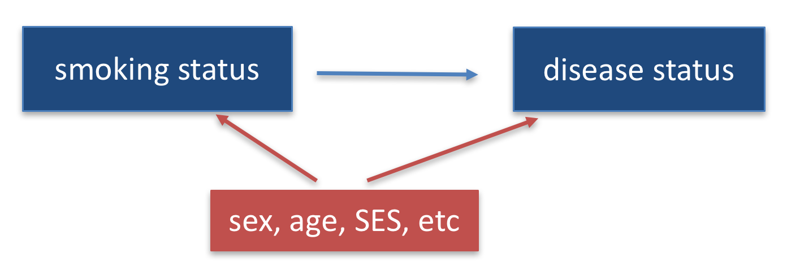

```{r setup, include=FALSE}
knitr::opts_chunk$set(echo = TRUE, message = FALSE)
knitr::opts_knit$set(root.dir = "/cloud/project")
```

## Preliminaries

First we load the packages that we will be using in this document.  It's good practices to load packages as the beginning so they are all in the same place.  If you decide later you need an additional package, add it to the top of the document!
```{r}
library(tidyverse)  # core group of tidyverse packages
library(kableExtra)  # to make nice tables
```

## Module 1: Smoking and the risk of disease

Questions of interest:

* **Question 1.1: ** How does the risk of disease compare for smokers and otherwise similar non-smokers?

<center>
{width=500px}
</center>

* **Queston 1.2: ** Does the contribution of smoking to the risk of disease vary by sex or socio-economic status (SES)?

<center>
{width=500px}
</center>

To address each question we want:

* A data display (graph or table)
* A statistical analysis (with interprepration)

We will answer these questions using data from the National Medical Expenditures Survey (NMES)

## Discussion of NMES data displays for Question 1-1

As we look at these displays, think about these questions:

* What are the characteristics of effective displays?
* How can the current displays be improved to answer our question of interest?

### Student work 1

```{r}
nmes_data <- read_csv("./Module1/nmesUNPROC.csv")

nmes_data <- nmes_data %>%
  mutate(eversmk = factor(eversmk, levels = c("0", "1"), labels = c("Never smoker", "Ever smoker")),
         lc5 = factor(lc5, levels = c("0", "1"), labels = c("No LC", "LC"))
         )

ggplot(data = nmes_data) + 
  geom_bar(mapping = aes(x = eversmk, fill = lc5), position = "dodge") +
  facet_wrap(~poor)
```

### Student work 2

```{r}
nmes_data <- read_csv("./Module1/nmesUNPROC.csv")

nmes_data <- nmes_data %>%
  mutate(eversmk = factor(eversmk, levels = c("0", "1"), labels = c("Never smoker", "Ever smoker")),
         lc5 = factor(lc5, levels = c("0", "1"), labels = c("No LC", "LC")),
         female = factor(female, levels = c("0", "1"), labels = c("Male", "Female"))
         )

ggplot(data=nmes_data) + geom_bar(mapping = aes (x=lc5, y = stat(prop), group = eversmk, fill=eversmk), position = "dodge") + facet_grid(~ female) + labs(
    title = "lc5 by eversmk",
    subtitle = "Stratified by gender",
    x = "lc5",
    y = "prop",
    fill = "eversmk"
    ) +
theme(legend.position = "bottom")
```

### Student work 3

```{r}
nmes_data <- read_csv("./Module1/nmesUNPROC.csv")

nmes_data <- nmes_data %>%
  mutate(eversmk = factor(eversmk, levels = c("0", "1"), labels = c("Never smoker", "Ever smoker")),
         lc5 = factor(lc5, levels = c("0", "1"), labels = c("No LC", "LC")), educate = factor(educate, levels = c("1", "2", "3", "4"), labels = c("College Grad", "Some College","HS Grad","other")), marital = factor(marital, levels = c("1", "2", "3", "4", "5"), labels = c("Married", "Widowed","Divorced","Separated", "Other")))
         
nmes_data_female <- nmes_data %>%
  filter(female == 1)

nmes_data_male <- nmes_data %>%
  filter(female == 0)

ggplot(data = nmes_data_female) + 
  geom_bar(mapping = aes(x = lc5, fill = eversmk), position = "fill") +
  facet_grid(~educate~marital)

ggplot(data = nmes_data_male) + 
  geom_bar(mapping = aes(x = lc5, fill = eversmk), position = "fill") +
  facet_grid(~educate~marital)
```

### Student work 4

```{r}
nmes_data <- read_csv("./Module1/nmesUNPROC.csv")

nmes_data <- nmes_data %>%
  
### Create variables for age, marital status, and education categories
  
  mutate( age_cat =     cut(age, 
                            breaks = c(0, 24, 34, 44, 54, 64, 100), 
                            right = TRUE,
                            labels = c("19-24","25-34","35-44",
                                       "45-54", "55-64","65+")),
          married_cat = cut(marital,
                            breaks = c(0, 1, 5),
                            right = TRUE,
                            labels = c("Currently/once married",
                                       "Never married")),
          educate_cat = cut(educate,
                            breaks = c(0, 1, 4),
                            right = TRUE,
                            labels = c("College grad",
                                       "Other"))) %>%
  
  ### Create labels using factor()
  
  mutate( female =  factor(female, 
                           levels = c(0,1), 
                           labels=c("Male", "Female")),
          educate = factor(educate,
                           levels = c(1,2,3,4),
                           labels = c("College grad", "Some college",
                           "HS grad", "Other")),
          poor =    factor(poor,
                           levels = c(0,1),
                           labels = c("Not poor", "Poor")),
          eversmk = factor(eversmk, 
                           levels = c("0", "1"), 
                           labels = c("Never smoker", "Ever smoker")), 
          lc5 =     factor(lc5, 
                           levels = c("0", "1"), 
                           labels = c("No LC", "LC")))

### Create bar graphs facet-gridded by age category and sex.
nmes_data %>%
  ggplot(aes(x=eversmk))+
    geom_bar(aes(fill=lc5), position = "fill")+
    facet_grid(age_cat~female) +
    labs(title = "Disease prevalence by ever smoker status, stratified by age-sex groups",
         x = "Ever smoker", 
         y = "Proportion with disease") +
    scale_fill_discrete(name = "Disease status") 

### Create table to reflect similar information
library(knitr)
nmes_data %>%
  count(age_cat, female, eversmk, lc5) %>%
  group_by(age_cat, female, eversmk, .drop = FALSE) %>%
  mutate(prop = n/sum(n)) %>%
  kable(col.names=c("Age group", "Sex", "Ever smoker status", "Disease status", "n", "Proportion"), digits=3)
```

### Student work 5

```{r}
nmes_data <- read_csv("./Module1/nmesUNPROC.csv")

### Re-coded to label smoking levels and lung cancer, as we did in class.
nmes_data <- nmes_data %>%
  mutate(eversmk = factor(eversmk, levels = c("0", "1"), labels = c("NS", "ES")),
         lc5 = factor(lc5, levels = c("0", "1"), labels = c("No LC", "LC")))
         
### 'Educate' column also recoded
nmes_data <- nmes_data %>%
  mutate(educate = factor(educate, levels = c("1", "2", "3", "4"), labels = c("ColGrad", "SomeCol", "HSGrad", "Other")), poor = factor(poor, levels = c("0", "1"), labels = c("Not poor", "Poor")))

### Data mutation to focus on those with lung cancer only. New table created

educatetab <- nmes_data %>%
  group_by(eversmk) %>%
  count(eversmk, lc5, educate, poor) %>%
  mutate(prop=n/sum(n)) %>%
  filter(lc5 == "LC")
         
### Display 1: Simple bar graph, y axis riskprop LC and x-axis eversmk

### Bar chart that compares risk of lung cancer for never smokers and ever smokers. No LC has been removed to better see the proportion with LC.


ggplot(data = educatetab) + 
  geom_bar(mapping = aes(x = eversmk, y = prop, group = lc5, fill = lc5), stat = "identity") + labs(title = "EverSmoke vs. Lung Cancer by Education", y = "Proportion", x = "EverSmoke") + scale_fill_discrete(name = "Lung Cancer") +
    facet_grid(educate~poor)
```

### Student work 6

```{r}
nmes_data <- read_csv("./Module1/nmesUNPROC.csv")

nmes_data = nmes_data %>%
  mutate(lc5 = factor(lc5, levels = c("0", "1"), labels = c("No LC", "LC")),
         chd5 = factor(chd5, levels = c("0", "1"), labels = c("No", "Yes")),
         eversmk = factor(eversmk, levels = c("0","1"), labels = c("Never Smoked", "Smoked")),
         poor = factor(poor, levels = c(0, 1), labels = c("Not Poor", "Poor")),
         beltuse = factor(beltuse, levels = c("1", "2", "3"), labels = c("Rare Belt Use", "Some Belt Use", "Always Belt Use")),
         educate = factor(educate, levels = c("1", "2", "3", "4"), labels = c("College Grad", "Some College", "HS Grad", "Other")))
         
ggplot(data = nmes_data) + 
  geom_bar(mapping = aes(x = lc5, y = stat(prop), fill = eversmk, group = eversmk), position = position_dodge2(preserve = "single")) +
  scale_fill_manual(values = c("green4", "red2")) +
  facet_grid(poor~educate) +
  labs(x = "Lung Cancer", y = "Proportion", fill = "Smoker Status")
```

### Student work 7

```{r}
nmes_data <- read_csv("./Module1/nmesUNPROC.csv")

nmes_data <- nmes_data %>%
  mutate(eversmk = factor(eversmk, 
                          levels = c("0", "1"), 
                          labels = c("Never smoker", "Ever smoker")), 
         lc5 = factor(lc5, 
                      levels = c("0", "1"), 
                      labels = c("No LC", "LC")), 
         poor = factor(poor, 
                       levels = c("0", "1"), 
                       labels = c("Not Poor", "Poor")))
         
ggplot(data = nmes_data) + 
  geom_bar(mapping = aes(x = eversmk, fill = lc5), position = "fill") +
  facet_wrap(~poor) +
  labs(title="Risk of LC Based on Financial Status")
```

### Student work 8

```{r}
nmes_data <- read_csv("./Module1/nmesUNPROC.csv")

nmes_data <- nmes_data %>%
  mutate(eversmk = factor(eversmk, levels = c("0", "1"), labels = c("Never", "Ever")),
         lc5 = factor(lc5, levels = c("0", "1"), labels = c("No LC", "LC")),
         female = factor(female, levels = c("0", "1"), labels = c("Male", "Female")))

nmes_data <- nmes_data %>%
  mutate(agegroup = case_when(age >= 90  & age <= 899 ~ '90s', age >= 80  & age <= 89 ~ '80s', age >= 70  & age <= 79 ~ '70s', age >= 60  & age <= 69 ~ '60s', age >= 50  & age <= 59 ~ '50s', age >= 40  & age <= 49 ~ '40s', age >= 30  & age <= 39 ~ '30s', age >= 20  & age <= 29 ~ '20s', age >= 18  & age <= 19 ~ '10s'))
         
ggplot(data = nmes_data) + 
  geom_bar(mapping = aes(x = eversmk, fill = lc5), position = "fill") +
  facet_grid(female~agegroup)
```

### Student work 9

```{r}
nmes_data <- read_csv("./Module1/nmesUNPROC.csv")

nmes_data <- nmes_data %>%
  mutate(eversmk = factor(eversmk, levels = c("0", "1"), labels = c("Never smoker", "Ever smoker")),
         lc5 = factor(lc5, levels = c("0", "1"), labels = c("No LC", "LC")),
         poor = factor(poor, levels = c("0", "1"), labels = c("Not poor", "Poor"))
         )
# Recoded eversmk so that where it said 0 before, it now says "Never smoker" and where it said 1 before it says "Ever smoker." Similarly, recoded lc5 so that where it said 0 before, it now says "No LC" and where it said 1 before it says "LC." Finally, recoded poor so that where it said 0 before, it now says "Not poor" and where it said 1 before it says "Poor."

nmes_data <- nmes_data %>%
   mutate(ageCat = cut(age, breaks=c(0, 40, 65, 99)))
#Added an age category column to make age a categorical variable

ggplot(data = nmes_data) + 
  geom_bar(mapping = aes(x = lc5, fill = eversmk), position = "fill") +
  facet_grid(poor~ageCat)
```

### Student work 10

```{r}
nmes_data <- read_csv("./Module1/nmesUNPROC.csv")

nmes_data <- nmes_data %>%
  mutate(
    eversmk = factor(eversmk, levels = c("0", "1"), labels = c("Never smoker", "Ever smoker")),
    lc5 = factor(lc5, levels = c("0", "1"), labels = c("No LC", "LC")),
    poor = factor(poor, levels = c("0", "1"), labels = c("Not poor", "Poor")),
    educate = factor(educate, levels = c("1", "2", "3", "4"), labels = c("HS grad", "Some college", "College grad", "Other"))
        )
### recoded eversmk, lc5, poor, and educate labels for graphing display purposes

ggplot(data = nmes_data) +
  geom_bar(mapping = aes(x = eversmk, y = stat(prop), group = lc5, fill = lc5), position = "fill") +
  facet_grid(educate ~ poor) +
  labs(
    title = "Risk of disease for smokers vs nonsmokers",
    subtitle = "Stratified by education and poverty status",
    x = "Smoking status",
    y = "Proportion"
  )
```

### Student work 11

```{r}
nmes_data <- read_csv("./Module1/nmesUNPROC.csv")

nmes_data <- nmes_data %>% mutate(mscd = lc5 + chd5)

nmes_data <- nmes_data %>%
  mutate(eversmk = factor(eversmk, levels = c("0", "1"), labels = c("Never smoker", "Ever smoker")),       mscd = factor(mscd, levels = c("0", "1"), labels = c("no mscd", "mscd"))
         )

nmes_data <- nmes_data %>%
  mutate(poor = factor(poor, levels = c("0", "1"), labels = c("Not Poor", "Poor")),
         educate = factor(educate, levels = c("1", "2", "3", "4"), labels = c("College grad", "Some college", "HS grad", "other"))
         )

ggplot(data = nmes_data) + 
  geom_bar(mapping = aes(x = eversmk, fill = mscd), position = "fill")+
  facet_grid(poor~educate)+
  labs(title="Proportion of Smokers and Non-Smokers with and without and MSCD", subtitle="Stratified by Poverty Status and Education", x="Smoker vs Non-Smoker", y="Proportion", color="MSCD Status") +
theme(legend.position="bottom")
```

## R notes based Assignment 1-1

### Recoding variables

Since we aren't sure which variables we will be using to make our plots and fit our models later, we want to recode all of the variables of the data set rather than just the variables we will use in our data display.

Remember that this is our codebook:

* `age`: age in years
* `female`: 1=female, 0=male
* `eversmk`: 1=has ever been a smoker, 0=has never been a smoker
* `current`: 1=current smoker, 0=not current smoker
* `former`: 1=former smoker, 0=not former smoker, NA if eversmk=0
* `packyears`: reported packs per year of smoking (0 if eversmk = No
* `yearsince`: years since quitting smoking (0 if eversmk = No)
* `totalexp`: self-reported total medical expenditures for 1987
* `lc5`: 1=Lung Cancer, Laryngeal Cancer or COPD, 0=none of these
* `chd5`: 1=CHD, Stroke, and other cancers (oral, esophageal, stomach, kidney and bladder), 0=none of these
* `beltuse`: 1=Rare, 2=Some, 3=Always/Almost always
* `educate`: 1=College grad, 2=Some college, 3=HS grad, 4=other
* `marital`: 1=Married, 2=widowed, 3=divorced, 4=separated, 5=never married
* `poor`: 1=Poor, 0=Not poor

At the beginning of your .Rmd file, you should recode **ALL** of these variables to have meaningful labels.
```{r}
nmes_data <- read_csv("./Module1/nmesUNPROC.csv")

nmes_data <- nmes_data %>%
  mutate(eversmk = factor(eversmk, levels = c("0", "1"), labels = c("Never smoker", "Ever smoker")),
         lc5 = factor(lc5, levels = c("0", "1"), labels = c("No LC", "LC")),
         chd5 = factor(chd5, levels = c("0", "1"), labels = c("No CHD", "CHD"))
         )

#etc, fill in the rest of appropriate variables here
```

### Combining LC and CHD into a single disease variable

If we really want to talk about the risk of **disease** where disease can be either LC or CHD, we want to combine into a single disease category.  This is what we called *major smoking-caused disease*, MSCD, in Public Health Biostatistics.

Here we will create a new variable based on `lc5 == "LC" | chd5 == "CHD"`, which stands for `lc5 == "LC"` OR `chd5 == "CHD"`.  The `|` symbol means that only one of the conditions needs to be true in order for the whole statement to be true.  So basically, if either a person has LC OR a person has CHD, we will designate them as having a diease.

```{r}
nmes_data <- nmes_data %>%
  mutate(disease = factor(lc5 == "LC" | chd5 == "CHD", 
                          levels=c(FALSE,TRUE), 
                          labels=c("No disease", "Yes disease")))


# We can take a look at the combine variable with the two individual variables
nmes_data %>%
  count(disease, lc5, chd5)
```

## Review of logistic regression

In Public Health Biostatistics, we asked the question: 

**Is the infant mortality risk (or odds) higher for twins than singleton births?**

We could answer this question using a 2x2 table:

|         | Singleton| Twin| Total|
|:--------|---------:|----:|-----:|
|Survived |      8899|  187|  9086|
|Died     |       526|   71|   597|
|Total    |      9425|  258|  9683|

In this case:

* Odds of death for twins: 71/187 = 0.38
* Odds of death for singletons: 526/8899 = 0.059
* Odds ratio of death for twins as compared to singletons: $$OR = \frac{odds \ for \ twins}{odds \ for \ singletons} = \frac{71/187}{526/8899} = 6.42$$
* Log odds ratio: $log_e(OR) = log(6.42) = 1.86$

We could also answer this question using logistic regression:

$$log(odds \ of \ death) = \beta_0 + \beta_1 \cdot twin$$

$$twin = \left\{
\begin{matrix}
1 & if \ twin\\
0 & if \ not \ twin
\end{matrix}
\right.$$


```{r}
nepal_data <- read_csv("./Module1/nepalData2019.csv")
model1 <- glm(death ~ twins, family=binomial(link="logit"), data=nepal_data)
summary(model1)
exp(coef(model1))
```

From this output we can interpret as follows:

* $1.86 = \beta_1 = \log(OR)$
* The log odds of death, comparing twins to singleton births, is 1.86.
* $6.41 = e^{1.86} = e^{\beta_1} = OR$
* The odds of death for twins is 6.42 times the odds of death for singleton births.
* The odds of death is 542% higher for twins than for singleton births.

We also asked: 

**Does the odds of death increase with increasing gestational age?**

$$\log(odds \ of \ death) = \beta_0 + \beta_1 \cdot (gestational \ age)$$

From this equation:

* $\log(odds \ of \ death | ga = 41 \ weeks) = \beta_0 + \beta_1 \cdot (41)$
* $\log(odds \ of \ death | ga = 40 \ weeks) = \beta_0 + \beta_1 \cdot (40)$
* Difference:
$$\log(odds \ of \ death | ga = 41 \ weeks) - \log(odds \ of \ death | ga = 40 \ weeks)$$
$$= (\beta_0 + 41\beta_1) - (\beta_0 + 40\beta_1) = \beta_1$$
* Log odds ratio:
$$\log(OR) = \log(\frac{odds|ga=41}{odds|ga=40})$$
$$= \log(odds \ of \ death | ga = 41 \ weeks) - \log(odds \ of \ death | ga = 40 \ weeks) = \beta_1$$
* Odds ratio: $OR = e^{\log(OR)} = e^{\beta_1}$

```{r}
model2 <- glm(death ~ gestage, family=binomial(link="logit"), data=nepal_data)
summary(model2)

exp(coef(model2))
```

From this output we can interpret as follows:

* $-0.1367 = \beta_1 = \log(OR)$
* An additional week of gestational age is associated with a decrease of 0.14 in the log odds of death.
* $0.87 = e^{-0.1367} = e^{\beta_1} = OR$
* An additional week of gestational age is associated with a 13% decrease in the odds of infant death.

**How could we account for any possible confounding variables in a logistic regression analysis?**

* We could include potential confounding variables as covariates in our analysis using multivariable logistic regression:

$$\log(odds \ of \ death) = \beta_0 + \beta_1 \cdot (gestational \ age) + \beta_2 \cdot twin + \beta_3 \cdot male$$
* We interpret the regression coefficients in a multivariable model as **ceteris paribus** -- holding all other things equal
* $\beta_1=\log(OR)$ for a one-unit change in gestational age, **holding twin status and sex constant**
* $\beta_2=\log(OR)$ comparing twins to singleton births, **holding gestational age and sex constant**
* $\beta_3=\log(OR)$ comparing male infants to female infants, **holding gestational age and twin status constant**

## Assignment 1.2

Do the following to address Question 1.1: How does the risk of disease compare for smokers and otherwise similar non-smokers?

* Improve your data display to answer this question.
* Fit a logistic regression model to answer this question.  Intepret your coefficients and significance tests to answer the question.  That is, what does this model say about Question 1.1?

* Submit your data display in R Markdown through GAithub by Sunday (February 9, 2020) at midnight.  (If you submit earlier than that, please email phbiostats@jhu.edu to let us know you're done!)
* You may work together on this assignment, but you must submit your own assignment; please credit in your assignment anyone with whom you collaborated.
* Next week in class we will start with discussion of your work this week.
