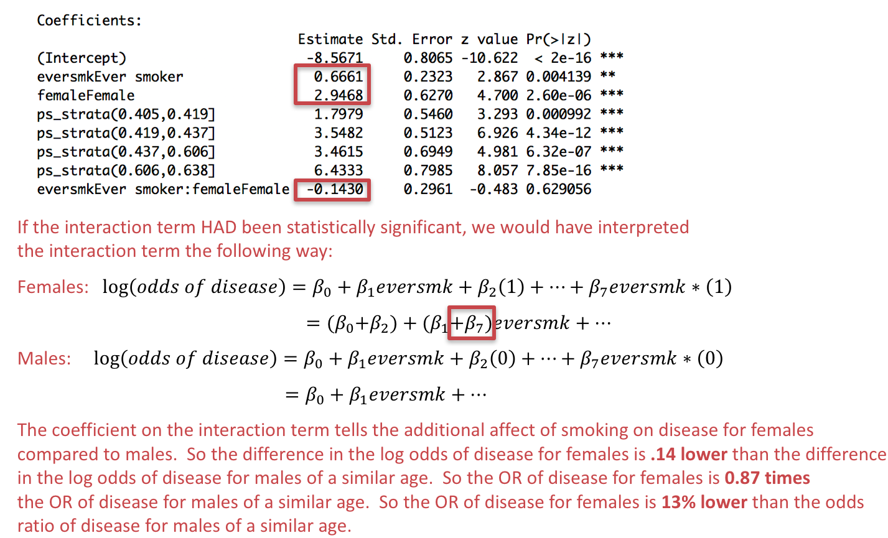

```{r setup, include=FALSE}
knitr::opts_chunk$set(echo = TRUE, message = FALSE, error = TRUE)
knitr::opts_knit$set(root.dir = "/cloud/project")
```

## Preliminaries

First load the packages that we will be using in this document:
```{r}
library(tidyverse)  # core group of tidyverse packages
library(knitr)  # to make nice tables
```

## Module 1: Smoking and the risk of disease

Questions of interest:

* **Question 1.1: ** How does the risk of disease compare for smokers and otherwise similar non-smokers?

<center>
{width=500px}
</center>

* **Queston 1.2: ** Does the contribution of smoking to the risk of disease vary by sex or socio-economic status (SES)?

<center>
{width=500px}
</center>

To address each question we want:

* A data display (graph or table)
* A statistical analysis (with interprepration)

We will answer these questions using data from the National Medical Expenditures Survey (NMES)

## Recoding the data
```{r}
nmes_data <- read_csv("./Module1/nmesUNPROC.csv")

nmes_data <- nmes_data %>%
  mutate(eversmk = factor(eversmk, levels = c("0", "1"), labels = c("Never smoker", "Ever smoker")),
         lc5 = factor(lc5, levels = c("0", "1"), labels = c("No LC", "LC")),
         chd5 = factor(chd5, levels = c("0", "1"), labels = c("No CHD", "CHD")),
         female = factor(female, levels= c("0", "1"), labels = c("Male", "Female")),
         current = factor(current, levels= c("0", "1"), labels = c("Not current smoker", "Current smoker")),
         former = factor(former, levels= c("0", "1"), labels = c("Not former smoker", "Former smoker")),
         beltuse = factor(beltuse, levels= c("1", "2", "3"), labels = c("Rare", "Some", "Almost always")),
         educate = factor(educate, levels= c("1", "2", "3", "4"), labels = c("College grad", "Some college", "HS grad", "Other")),
         marital = factor(marital, levels= c("1", "2", "3", "4", "5"), labels = c("Married", "Widowed", "Divorced", "Separated", "Never married")),
         poor = factor(poor, levels= c("0", "1"), labels = c("Not poor", "Poor"))
         )

nmes_data <- nmes_data %>%
  mutate(disease = factor(lc5 == "LC" | chd5 == "CHD", 
                          levels=c(FALSE,TRUE), 
                          labels=c("No disease", "Yes disease")))
```

## Interpreting propensity score results

Suppose we calculate propensity scores based on **age** and **sex**:
```{r}
# fit propensity score model: trt ~ confounders
prop_model <- glm(eversmk ~ age + female, family = binomial(link="logit"), data=nmes_data, na.action = na.exclude)

# calculate propensity scores:
nmes_data <- nmes_data %>%
  mutate(ps = predict(prop_model, type = "response"))

# calculate propensity score quintiles:
ps_quintiles <- quantile(nmes_data$ps, probs=c(0, 0.2, 0.4, 0.6, 0.8, 1), na.rm=TRUE)

nmes_data <- nmes_data %>%
  mutate(ps_strata = cut(ps, breaks=ps_quintiles, include.lowest=TRUE))

# model log odds of disease from smoking and ps quintiles
model_ps_strata <- glm(disease ~ eversmk + ps_strata, family = binomial(link="logit"), data=nmes_data)
summary(model_ps_strata)

# transform log OR to OR
exp(coef(model_ps_strata))
```

We would interpret the coefficient for `eversmk` as follows.  We *do not* need to interpret the coefficients for the propensity score quintiles because these variables are just there for adjustment purposes are are not the relationship of interest!

<center>
{width=600px}
</center>

## Effect modification

Now we will finally consider **Queston 1.2: ** Does the contribution of smoking to the risk of disease vary by sex or socio-economic status (SES)?

<center>
{width=500px}

</center>

An **effect modification** (or **interaction**) is present when the relationship between a predictor of interest and the outcome varies by the level (subgroup) of another variable.

For example, if we thought the effect of smoking on disease was different (larger or smaller) for males than it is for females, we would want to consider a model that allows sex to *modify* the relationship between smoking and disease.

### Ways to include effect modification

* We could do separate analyses for each subgroup and report the estimate with confidence interval by subgroup.

**OR**

* We could include an interaction between smoking and the indicator of the subgroup in the second step of the propensity score analysis.

What would this look like compared to the analysis we did before where we constructed propensity scores based on age and sex?

### Separate analyses for each subgroup

First, let's do separate analyses for each subgroup of sex.  To do this, we need to create subsets of our data that just contain the males and just contain the females:
```{r}
nmes_data_male <- nmes_data %>%
  filter(female=="Male")

nmes_data_female <- nmes_data %>%
  filter(female=="Female")
```

Now we do our propensity score analysis for each subgroup separately, so on the `nmes_data_male` data set instead of the `nmes_data` data set.

We will have to be careful here *not* to include sex when we construct our propensity scores, however, because everyone in each of these subsets of data has the same value of sex.

First we do this for male individuals.  To save myself some copy/paste errors when I do the same for female individuals, I am going to define a generic data set at the top of this code:
```{r}
my_data <- nmes_data_male

# fit propensity score model: trt ~ confounders
prop_model <- glm(eversmk ~ age + female, family = binomial(link="logit"), data=my_data, na.action = na.exclude)

# we shouldn't include `female` in this propensity score model, since all subjects are male!
prop_model <- glm(eversmk ~ age, family = binomial(link="logit"), data=my_data, na.action = na.exclude)

# calculate propensity scores:
my_data <- my_data %>%
  mutate(ps = predict(prop_model, type = "response"))

# calculate propensity score quintiles:
ps_quintiles <- quantile(my_data$ps, probs=c(0, 0.2, 0.4, 0.6, 0.8, 1), na.rm=TRUE)

my_data <- my_data %>%
  mutate(ps_strata = cut(ps, breaks=ps_quintiles, include.lowest=TRUE))

# model log odds of disease from smoking and ps quintiles
model_ps_strata <- glm(disease ~ eversmk + ps_strata, family = binomial(link="logit"), data=my_data)
summary(model_ps_strata)

# transform log OR to OR
exp(coef(model_ps_strata))

# also get confidence intervals of OR
exp(confint.default(model_ps_strata))

```

**We estimate the odds of disease for male smokers are 2 times the odds for male non-smokers of similar ages (95% CI for OR: 1.25 to 3.18).**

Now we do this for female individuals:
```{r}
my_data <- nmes_data_female

# fit propensity score model: trt ~ confounders
# we shouldn't include `female` in this propensity score model, since all subjects are male!
prop_model <- glm(eversmk ~ age, family = binomial(link="logit"), data=my_data, na.action = na.exclude)

# calculate propensity scores:
my_data <- my_data %>%
  mutate(ps = predict(prop_model, type = "response"))

# calculate propensity score quintiles:
ps_quintiles <- quantile(my_data$ps, probs=c(0, 0.2, 0.4, 0.6, 0.8, 1), na.rm=TRUE)

my_data <- my_data %>%
  mutate(ps_strata = cut(ps, breaks=ps_quintiles, include.lowest=TRUE))

# model log odds of disease from smoking and ps quintiles
model_ps_strata <- glm(disease ~ eversmk + ps_strata, family = binomial(link="logit"), data=my_data)
summary(model_ps_strata)

# transform log OR to OR
exp(coef(model_ps_strata))

# also get confidence intervals of OR
exp(confint.default(model_ps_strata))
```

**We estimate the odds of disease for female smokers are 1.86 times the odds for female non-smokers of similar ages (95% CI for OR: 1.29 to 2.67).**

In these subgroups, it doesn't appear there is effect modification, because although the estimated odds ratios are different, the confidence intervals for these odds ratios overlap.

### Including an interaction term

We can consider effect modification directly in our overall model by including an interaction term between our effect modifier and the treatment variable along with propensity adjustment.  

To do this, we first construct propensity scores, making sure to include the effect modifier in the propensity score calculation:
```{r}
my_data <- nmes_data

# fit propensity score model: trt ~ confounders, making sure to include the effect modifier here!
prop_model <- glm(eversmk ~ age + female, family = binomial(link="logit"), data=my_data, na.action = na.exclude)

# calculate propensity scores:
my_data <- my_data %>%
  mutate(ps = predict(prop_model, type = "response"))

# calculate propensity score quintiles:
ps_quintiles <- quantile(my_data$ps, probs=c(0, 0.2, 0.4, 0.6, 0.8, 1), na.rm=TRUE)

my_data <- my_data %>%
  mutate(ps_strata = cut(ps, breaks=ps_quintiles, include.lowest=TRUE))
```

Then, we can model the log odds of disease based on `eversmk`, `female`, and the interaction between the two:
```{r}
# model log odds of disease from smoking and ps quintiles, with an interaction between eversmk*female
model_ps_strata <- glm(disease ~ eversmk*female + ps_strata, family = binomial(link="logit"), data=my_data)
summary(model_ps_strata)

# transform log OR to OR
exp(coef(model_ps_strata))

# also get confidence intervals of OR
exp(confint.default(model_ps_strata))
```

There's no evidence of effect modification (interaction) between sex and smoking status, because the interaction term is not statistically significant (p = 0.63).  So we would not use this interaction model and would instead return to the propensity score model without the interaction.

How **would** we have interpreted the interaction terms **if** the interaction had been statistically significant?

<center>
{width=600px}
</center>

## Assignment 1.4: Final Module 1 Report

Finalize your report for Module 1 to answer Questions 1.1 and 1.2.

* For each question, you should have a data display and a statistical analysis to address the question.

    * For Question 1.2, think about what type of graph would show whether there is effect modification.
    * Include an interaction in your propensity score analysis to formally test whether effect modification exists. 

* Provide a caption for your data displays (see below for some hints on how to do this!)

* Write up your results in a few paragraphs to answer both questions.  In your write-up, you should refer to your data displays and your analysis results.  Be numerate!

* Here's a great resource for tables/figures for scientific papers:
[http://abacus.bates.edu/~ganderso/biology/resources/writing/HTWtablefigs.html](http://abacus.bates.edu/~ganderso/biology/resources/writing/HTWtablefigs.html)


Submit your data display in R Markdown through Github by Monday (February 24, 2020) at midnight.

* You may work together on this assignment, but you must submit your own assignment; please credit in your assignment anyone with whom you collaborated.

* Next week in class we will start Module 2!

## Some odds and ends for your final report

### Using knitr and pander package for tables

We already talked about using the `kable()` function (from the `knitr` package) to make your tables look nicer:

Original:
```{r}
nmes_data %>%
  count(disease)
```

Nicer:
```{r}
nmes_data %>%
  count(disease) %>%
  kable()
```

You can also add a caption to a table directly with the `kable()` function:
```{r}
nmes_data %>%
  count(disease) %>%
  kable(caption = "Number of individuals with and without Major smoking-caused disease")
```

And you can change the number of decimals displayed in the table pretty easily as well.  Generally displaying only 3 significant figures in your tables is a good idea when you have values that include decimals.
```{r}
nmes_data %>%
  count(eversmk, disease) %>%
  group_by(eversmk) %>%
  mutate(prop = n/sum(n)) %>%
  filter(disease == "Yes disease") %>%
  kable(caption = "Proportions of individuals with and without a MSCD by smoking status", digits=3)
```

There is also a package called `pander` which makes nice tables from the model output. You can install `pander` by running `install.packages("pander")`.

```{r}
library(pander)
pander(summary(glm(disease ~ eversmk + age + female, family=binomial(link="logit"), data=nmes_data)))
```


### Making your report a little more readable

For your final assignment for this module, we will be asking you to write a report presenting your analysis with the answers to the questions posed. We want you to include all the code that you used for the analysis in the Rmd file, but not necessarily to print the output of the code to your html document. There are some very helpful tips for managing whether code and code output get printed to the screen to be found on the second page of this `rmarkdown` cheat sheet: https://www.rstudio.com/wp-content/uploads/2015/02/rmarkdown-cheatsheet.pdf

For example, if you want to create a table where you display the table, but not the code, you could put `echo=FALSE` in the top of the code chunk for that piece of code:
```{r , echo=FALSE}
nmes_data %>%
  count(eversmk, disease) %>%
  group_by(eversmk) %>%
  mutate(prop = n/sum(n)) %>%
  filter(disease == "Yes disease") %>%
  kable(caption = "Proportions of individuals with and without a MSCD by smoking status", digits=3)
```

Similarly, if you have a code chunk that includes necessary code (that needs to run) but you don't want to see the code or the result of running that code, you can use `echo=FALSE` and `include=FALSE` in the top of the code chunk.
```{r , echo=FALSE, include=FALSE}
nmes_data %>%
  count(eversmk, disease) %>%
  group_by(eversmk) %>%
  mutate(prop = n/sum(n)) %>%
  filter(disease == "Yes disease") %>%
  kable(caption = "Proportions of individuals with and without a MSCD by smoking status", digits=3)
```

There are some very helpful tips found here: http://kbroman.org/knitr_knutshell/pages/Rmarkdown.html

### Selecting colors for figures

You can select colors from the chart at http://research.stowers.org/mcm/efg/R/Color/Chart/ColorChart.pdf and then use the `colors()` function to assign them.

For example:

```{r}
plot_data <- nmes_data %>%
  count(eversmk, disease) %>%
  group_by(eversmk) %>%
  mutate(prop = n/sum(n)) %>%
  filter(disease == "Yes disease")

ggplot(plot_data) +
  geom_bar(aes(x=eversmk, y=prop), stat="identity", fill=colors()[c(81,119)])
```

Sometimes it's better to leave these things to the professionals: https://www.r-bloggers.com/r-using-rcolorbrewer-to-colour-your-figures-in-r/

You'll need to install and load the `RColorBrewer` package with `install.packages("RColorBrewer")` and:
```{r , echo=FALSE}
library(RColorBrewer)
```

You can see all possible colors by doing:
```{r}
display.brewer.all()
```

This makes it easy to pick nice contrasting colors, colors along a gradient, etc. For example:
```{r, echo=FALSE}
cols <- brewer.pal(8,"Set1")
```

```{r}
ggplot(plot_data) +
  geom_bar(aes(x=eversmk, y=prop), stat="identity", fill=cols[1:2])
```

The cool thing about `ggplot2` is that everything just builds on top of what you've already accomplished, so if you want to change the background, you can just change the theme with one more short line of code. Here, we'll use `theme_bw()` to remove the default gray background. We'll then add an additional line of code to change the color of the bars using `scale_fill_manual()`. Finally, we will relabel the axes and title using `labs()`.

```{r}
# Change the appearance of the plot
ggplot(plot_data) +
  geom_bar(aes(x=eversmk, y=prop, fill=eversmk), stat="identity") +
  theme_bw() +
  scale_fill_manual(values=c(cols[1:2])) +
  labs(y="Risk of MSCD",x="",title="Risk of MSCD, comparing smokers to non-smokers")
```

One more important piece of controling the look of your plot in ggplot2 uses `theme()`. You can control the look of your graphing using the *many* arguments of theme. Here, we'll introduce how to change the axis text size; however, if you type `?theme` below, you'll see all of the things that can be changed on your plots using `theme()`. For a good demonstration of themes, see https://cran.r-project.org/web/packages/ggthemes/vignettes/ggthemes.html

```{r}
# Here, we'll start playing with font size
ggplot(plot_data) +
  geom_bar(aes(x=eversmk, y=prop, fill=eversmk), stat="identity") +
  theme_bw() +
  scale_fill_manual(values=c(cols[1:2])) +
  labs(y="Risk of MSCD",x="",title="Risk of MSCD, comparing smokers to non-smokers")+
  theme(axis.text=element_text(size=12))
```

Finally, here's a link to good resource about adding lables, text, scales, and themes to your graphics: https://r4ds.had.co.nz/graphics-for-communication.html
