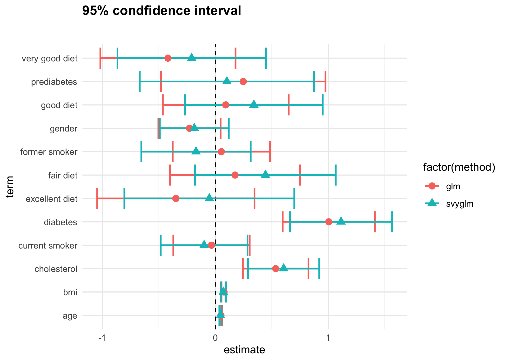

```{r setup, include=FALSE}
knitr::opts_chunk$set(echo = TRUE, message = FALSE, error = TRUE)
knitr::opts_knit$set(root.dir = "/cloud/project")
```

## Preliminaries

First load the packages that we will be using in this document. You will need to install some of these since we have not used them before.
```{r}
library(tidyverse)  # core group of tidyverse packages
library(knitr)  # to make nice tables
library(ggpubr)
library(ggrepel)
library(tidyverse)
library(kableExtra)
library(survey)
library(haven)
library(broom)
library(plotrix)

```

# Motivation

Hypertension is one of the most common diseases in the world. 
It has been associated with myocardial infarction, stroke, renal 
failure, and death if not detected early and treated appropriately.
According to the Center for Disease Control's [Behavioral Risk Factor Surveillance System (BRFSS)](https://www.cdc.gov/brfss/){target="_blank"}, around 75 million American adults (32%) are estimated to have 
high blood pressure, costing the US around $48.6 billion 
each year. This total includes the cost of healthcare services, 
medications to treat high blood pressure, and missed days of work.

In this module, we will explore the relationship between hypertension and a variety of risk factors.

This case study introduces survey methods for logistic regression and compares the results from survey-weighted logistic regression to standard logistic regression. The plot below visualizes the comparison between these two methods; it shows the estimated coefficients (with standard error) from each method for the risk factors under consideration.  Note that both the estimates and their standard errors are different when using ([logistic regression](https://en.wikipedia.org/wiki/Logistic_regression){target="_blank"}
and [survey-weighted logistic regression](http://citeseerx.ist.psu.edu/viewdoc/download;jsessionid=9591E971AF4061BBF8F98083422FF313?doi=10.1.1.151.6423&rep=rep1&type=pdf){target="_blank"}). We will discuss later which model is a better choice 
for this analysis. 

<center>

</center>

Our main questions of interest are:

  * Question 2.1: What factors measured in the NYC HANES survey are associated with having hypertension?
  * Question 2.2: How do our estimates from survey-weighted logistic regression differ from those where we ignore survey weights?


The libraries used in this study are listed in the following table, 
along with their purpose in this particular case study:


|Library|Purpose|
|---|--------------------------------------------------------------------------------------------------------------|
|`tidyverse`|A coherent system of packages for data manipulation, exploration and visualization|
|`haven`|A useful tool to import and export data from SAS, STATA, and SPSS formats|
|`broom`|Takes the messy output of built-in functions in R, such as lm, nls, or t.test, and turns it into tidy data frames|
|`survey`|Provides useful functions for analyzing complex survey samples|
|`ggpubr`|Provides some easy-to-use functions for creating and customizing 'ggplot2'- based publication ready plots|
|`ggrepel`|Provides text and label geoms for 'ggplot2' that help to avoid overlapping text labels|
|`kableExtra`|Helps with building common complex tables and manipulating table styles; creates awesome HTML tables|
|`plotrix`|A variety of plots, various labeling, axis and color scaling functions|
|`knitr`|---|

In order to run the code for this module, please ensure you have these packages installed. 

The learning objectives for this module include:

  * data cleaning/visualization
  * logistic regression
  * survey-weighted analysis
  * selection of survey weights for unbalanced data

# What are the data?

For this case study, we will use data from the [New York City (NYC) Health and Nutrition Examination Survey (NYC HANES)](http://nychanes.org/){target="_blank"}, 
modeled on the 
[National Health and Nutrition Examination Survey (NHANES)](https://wwwn.cdc.gov/nchs/nhanes/default.aspx){target="_blank"}. NHANES is a population-based, cross-sectional study with data collected 
from a physical examination and laboratory tests, as well as a face-to-face 
interview and an audio computer-assisted self-interview (ACASI). It is 
designed to assess the health and nutritional status of adults and children 
in the United States. NYC HANES is a local version of NHANES, which implies 
it mainly focuses on New York area. 

To access the NYC HANES data, go to the [NYC HANES data page](http://nychanes.org/data/){target="_blank"} and  click the **NYC HANES Analytics Datasets** link; it will download automatically.  (A static link to this datafile can be found [here](http://nychanes.org/wp-content/uploads/sites/6/2019/01/public_v3_122018.sas7bdat){target="_blank"}.)

The data we will be using in this case study was collected from August 2013 to June 2014 and is called the 
**NYC HANES 2013-14 Blood Pressure Data**.  The survey used a probability sample of non-institutionalized adult 
New York City residents (ages 20 years or older) to provide 
representative citywide estimates. For further details, please refer to 
the [NYC HANES website](http://nychanes.org/){target="_blank"}.

In addition to the datafile, there are other useful resources available on the website including: 

* [Data Documents](http://nychanes.org/wp-content/uploads/sites/6/2019/01/28283961_Data-Documentation.pdf){target="_blank"}: 
Provides information on how best to analyze the NYC HANES 2013-14 dataset, given its population-based 
and clustered sampling scheme.
* [Analytics Guideline](http://nychanes.org/wp-content/uploads/sites/6/2015/11/ANALYTIC-GUIDELINES-2016_V2.pdf){target="_blank"}: 
Provides overall guidance on the use of the NYC HANES 2013-14 dataset and statistical weights, 
as well as other analytic issues pertaining to assessing statistical reliability of estimates.
* [Variable Codebook](http://nychanes.org/wp-content/uploads/sites/6/2019/01/28283961_NYC-HANES_codebook_Public_V3_011019.pdf){target="_blank"}: Defines the variables included in the dataset and describes how values for these variables are coded.
* [Weight Adjustment](http://nychanes.org/wp-content/uploads/sites/6/2015/11/NYC-HANES-Training-Slides_part-2_08222016.pdf){target="_blank"}: 
Explains how NYC HANES data are weighted in order to compensate for unequal probability of selection and explains how to choose the correct weight for analysis.
* [Questionnaire](http://nychanes.org/wp-content/uploads/sites/6/2015/11/28283961_NYC-HANES-2013-14_Questionnaire.pdf){target="_blank"}: Shows the questionnaire that participants in the study completed.

All of these documents enable data analysts to understand the definitions and coding of the variables and then complete the analysis appropriately.

# Learning objectives for today

Our main question of interest for this module is: Based on the data collected from NYC HANES, which risk factors play a role in development of hypertension?

Today, we will start by learning how to:

* Read in the SAS-formatted data
* Select and rename variables, based on the data dictionary 
* Inspect the data to look for whether data cleaning needs to be performed
* Make initial data visualizations to begin to explore the question of interest


# Initial data inspection and cleaning

The NYC HANES data file we are working with is a SAS formatted file, so 
we will use the function `read_sas()` from the `haven` library 
to read in the data and create a [tibble](https://tibble.tidyverse.org){target="_blank"} 
(or `tbl_df`) in `R`. Tibbles are nice because they do not change variable 
names or data types, and they have an enhanced `print()` method which
makes it easier to view the data when working with large datasets containing complex objects. 
The [`haven` library](https://www.rdocumentation.org/packages/haven/versions/2.1.0){target="_blank"} 
is useful to import and export files saved in a variety of formats such as
[SAS, STATA, and SPSS](http://stanfordphd.com/Statistical_Software.html){target="_blank"}. 

We now read in the data and check the dimensions of the data object:
```{r read-data}
dat <- read_sas('Module2/data/d.sas7bdat')
dim(dat)
```

Our data contains `r nrow(dat)` observations on `r ncol(dat)` 
different variables. For our analysis, we will only consider a subset of these variables.


# Data wrangling

## Select the variables (or columns)

This is a survey dataset based on interviews and questionnaires
with `r ncol(dat)` variables. Some variables are not relevant 
to our current research question, such as 
_'LAQ1: What language is being used to conduct this interview'_. 

Although previous research has shown hypertension is associated  with 
drinking, smoking, cholesterol values, and triglyceride levels, we will instead consider whether other variables -- which 
at first might not seem highly related to hypertension -- have an association with 
hypertension. We've selected 13 variables to consider in our 
analysis.  

We will use the `select()` function from the `dplyr` package
to choose and rename the columns that we want. 

Here is a simple example to show how the renaming of the column names works:

```{r}
rename <- 
  dat %>% 
    select(id = KEY,
           race = DMQ_14_1,
           diabetes = DX_DBTS)
colnames(rename)
```

In this example, we select the three variables of `KEY`, `DMQ_14_1`, and `DX_DBTS` and rename them to the more descriptive `id`, `race`, and `diabetes`.  We save this smaller and renamed data frame in the `rename` object rather than write over our originial data. Undoubtedly, compared with `DMQ_14_1` and `DX_DBTS`, 
`race` and `diabetes` are more readable and more easily to understand.

Now we select and rename the 13 variables we will consider in our analysis:

```{r select-cols}
hy_df <- 
  dat %>% 
    select(id = KEY,
           age = SPAGE,
           race = DMQ_14_1,
           gender = GENDER,
           diet = DBQ_1,
           income = INC20K,
           diabetes = DIQ_1,
           bmi = BMI,
           cholesterol = BPQ_16,
           drink = ALQ_1_UNIT,
           smoking = SMOKER3CAT,
           hypertension = BPQ_2,
           surveyweight = EXAM_WT)
```

We will give some description of each variable below, but for full details we refer the reader to the
[Variable Codebook](http://nychanes.org/wp-content/uploads/sites/6/2019/01/28283961_NYC-HANES_codebook_Public_V3_011019.pdf){target="_blank"}.


### Non-categorical variables 

There are four non-categorial variables that we will use in our analysis:

  * `id`: Sample case ID, unique to each individual in the sample
  * `age`: Sample age, range 22-115 years
  * `bmi`: BMI = $kg/m^2$ where $kg$ is a person's weight in kilograms and $m$ is their height in meters
  * `surveyweight`: Numeric values associated with each observation to let us know how much weight the observation should receive in our analysis (more details later)
  
### Categorical variables 

We will consider ten categorial variables: 

  * `race`: 
    + 100 = White
    + 110 = Black/African American
    + 120 = Indian
    + 140 = Native Hawaiian/Other Pacific Islander
    + 180 = Asian
    + 250 = Other race
  * `gender`:
    + 1 = Male
    + 2 = Female
  * `born`:
    + 1 = US born
    + 2 = Other country
  * `diet`: 
    + 1 = Excellent
    + 2 = Very good 
    + 3 = Good
    + 4 = Fair
    + 5 = Poor
  * `diabetes`: Has person ever been told by a doctor or health professional that they have diabetes or sugar diabetes?
    + 1 = Yes
    + 2 = No 
    + 3 = Prediabetes
  * `cholesterol`: Has person ever been told by a doctor or health professional that their blood cholesterol was high?
    + 1 = Yes
    + 2 = No
  * `drink`: In the past 12 months, how often did sample drink any type of alcoholic beverage
    + 1 = Weekly
    + 2 = Monthly
    + 3 = Yearly
  * `smoke`: 
    + 1 = Never smoker
    + 2 = Current smoker
    + 3 = Former smoker
  * `income`:
    + 1 = Less than $20,000
    + 2 = $20,000 - $39,999
    + 3 = $40,000 - $59,999
    + 4 = $60,000 - $79,999
    + 5 = $80,000 - $99,999
    + 6 = $100,000 or more
  * `hypertension`: Has person ever been told by a doctor or health professional that they have hypertension or high blood pressure?
    + 1 = Yes
    + 2 = No
    
## Initial data inspection

The first step of any data analysis should be to explore 
the data through data visualizations and data summaries like
tables and summary statistics. There are several ways that you 
can have an initial glance at your data. The `summary()` or `head()` functions in are excellent 
ways to help you have a quick look at the data set.

The `summary()` function tabulates categorical variables and 
provides summary statistics for continuous variables, while also 
including a count of missing values, which can be very important 
in deciding what variables to consider in downstream analysis.

```{r}
summary(hy_df)

```


We see that certain variables have a large number of `NA` values; in 
particular `drink` has `r sum(is.na(hy_df$drink))` 
`NA` values and `income` has `r sum(is.na(hy_df$income))` 
`NA` values. Directly removing rows containing missing data is not desirable 
considering the large number of such rows, so we should look more 
closely at the missing values. 

Using the [Variable Codebook](http://nychanes.org/wp-content/uploads/sites/6/2019/01/28283961_NYC-HANES_codebook_Public_V3_011019.pdf){target="_blank"}, we see that the variable we've chosen for `drink`, `ALQ_1_UNIT` in the originial survey data, seems to be a follow-up question to the earlier variable `AlQ_1`, which asks how often did the survey participant drink any type of alcoholic beverage.  For this first question, a value of 0 means they never drink.

Let's look at the frequency of counts of this first `AlQ_1` variable with the function `count()`.

```{r}
dat %>% count(ALQ_1) %>% print(n=Inf)
```

There are `r sum(dat$ALQ_1 == 0, na.rm = TRUE)` people who indicated that they never drink.  These individuals would not have answered the following question (`AlQ_1_unit`) to give a frequency of drinking in the past 12 months.  Now we see why there are so many missing values for `drink`. 
Among these `r sum(is.na(hy_df$drink))` missing values, 
`r sum(dat$ALQ_1 == 0, na.rm = TRUE)` samples never drink and 
there are just 
`r sum(is.na(hy_df$drink)) - sum(dat$ALQ_1 == 0, na.rm = TRUE)`
actual missing values. Therefore, merging these two variables 
as one is a better way to capture drinking that includes those who never drink. We label those subjects who answered `0` to variable `AlQ_1` (those who never drink) as 4.
```{r}
hy_df %>% count(drink)
hy_df <- hy_df %>% 
          mutate(drink = ifelse(dat$ALQ_1 == 0, 4, drink))
hy_df %>% count(drink)

```

Now our variable `drink` has values as follows:

  * `drink`: In the past 12 months, how often did sample drink any type of alcoholic beverage
    + 1 = Weekly
    + 2 = Monthly
    + 3 = Yearly
    + 4 = Never

And we can see only 6 missing values for `drink` are left now.
```{r}
hy_df %>% count(drink)
```

## Adjust data types

From the data summaries above, we can see that there are several 
categorical variables like `race`, `gender`, `born`, `diet`, `income`, `diabetes`, `bmi`, `drink`, and `smoke`, which are currently being 
treated as numerical values (giving means/medians in the summary) but are really categorical variables that should be treated as factors. This is because the categories are simply labeled with numbers.

We want to convert these categorical variables to factors using the nummerical values and categoy labels given in the 
[Variable Codebook](http://nychanes.org/wp-content/uploads/sites/6/2019/01/28283961_NYC-HANES_codebook_Public_V3_011019.pdf){target="_blank"} 
and shown earlier in this document.

We can use the `factor()` function in base R to convert each 
variable and assign the correct levels. Any values that are not 
included in the `levels` argument will get set to `NA` values. 
We also want to think about creating a natural ordering to the 
factor levels here: the first level will generally be our 
reference level in a regression model, so it makes sense to try
to give them an order that reflects our choice of reference group.  For example, we will want to compare individuals who drink weekly, monthly, or yearly to those who never drink, so we order the `drink` variable as `Never`, `Weekly`, `Monthly`, `Yearly` even though the numerical values in that order are 4, 1, 2, 3.

```{r recodeFactors}
hy_df <- hy_df %>% mutate(race=factor(race, levels=c(100, 110, 120, 140, 180, 250), 
                      labels=c('White', 'Black/African American', 
                              'Indian /Alaska Native', 
                              'Pacific Islander', 
                              'Asian', 'Other Race')),
                     gender = factor(gender, levels=c(1,2), 
                        labels=c('Male', 'Female')),
                     diet = factor(diet, levels=c(5:1), 
                      labels=c('Poor', 'Fair', 'Good', 
                               'Very good','Excellent')),
                     income = factor(income, levels=c(1:6), 
                        labels=c('Less than $20,000','$20,000 - $39,999',
                                 '$40,000 - $59,999','$60,000 - $79,999',
                                 '$80,000 - $99,999','$100,000 or more')),
                     diabetes = factor(diabetes, levels=c(2,1,3), 
                          labels=c('No','Yes','Prediabetes')),
                     cholesterol = factor(cholesterol, levels=c(2,1), 
                             labels=c('Low value','High value')),
                     drink = factor(drink, levels=c(4,1,2,3), 
                       labels=c('Never','Weekly', 'Monthly', 'Yearly')),
                     smoking = factor(smoking, levels=c(3:1), 
                         labels=c('Never smoker','Former smoker','Current smoker')),
                     hypertension = factor(hypertension, levels=c(2,1), 
                              labels=c('No','Yes'))
                     )

```

If we look at a summary of our data set again, we see that now the `summary()` function gives us counts for each category of these variables rather than the meaningless numerical summaries, like means, it was giving before.
```{r}
summary(hy_df)
```


# Exploratory data analysis

Before doing any modeling, we start with simple data visualizations to look at 
the data and investigate how the different 
variables are related to one another. Plots can identify the trends 
or patterns in the variables of interest and inform the next steps in the data analysis. For our 
data visualizations, we will mainly use the package `ggplot2` available as one of the core `tidyverse` packages. A link for its cheat sheet is [here]( https://www.rstudio.com/wp-content/uploads/2015/03/ggplot2-cheatsheet.pdf){target="_blank"}.

The type of plot we will make will depend on the type of variable(s) we are plotting.  First, let's look at the relationship between `hypertension` (categorical) and `age` (numeric). Since `hypertension` is the categorical variable, we can compare the age distributions between those who are hypertense and those who are not using side-by-side boxplots.  Here the variable on the x-axis is `hypertension` and the variable on the y-axis is `age`, which corresponds to the `aes(x=hypertension, y=age)` definition in the `ggplot` aesthetic definition.

```{r, fig.width=4, fig.height=4}
p1 <- hy_df %>% 
        ggplot(aes(x = hypertension, y = age)) +
          geom_boxplot() + 
          ggtitle('Distribution of age by hypertension status')
p1
```

From this plot, we see that we need to pay attention to the missing values here, since we are getting a boxplot for the missing values.  We can remove all rows from our dataset that containing any missing values with the function `drop_na()` in  `tidyr` library and store in a new data frame:

```{r}
hy_p_df <- 
  hy_df %>%
  drop_na()

dim(hy_p_df)
```

This will drop all rows which still contain missing values. By checking the dimensions of our new data frame, `hy_p_df`, we see that we retain `r nrow(hy_p_df)` observations with `r ncol(hy_p_df)` different variables.

Now we can make the same plot without missing values:

```{r, fig.width=4, fig.height=4}
p1 <- hy_p_df %>% 
        ggplot(aes(x = hypertension, y = age)) +
          geom_boxplot() + 
          ggtitle('Distribution of age by hypertension status')
p1
```

Comparing the medians of these two boxplots, we see that people who are hypertense tend to be older than people who are not, which indicates that age is related to hypertension.

What about a plot for investigating the relationship between `hypertension` and `gender`? Let's try three different ways to plot the categorical variable `gender` with `hypertension`.  We'll use the function `ggarrange()` in [package `ggpubr`](https://www.rdocumentation.org/packages/ggpubr/versions/0.2){target="_blank"} to arrange multiple ggplots on the same page. 

```{r, fig.width=11, fig.height=5}
p2 <- hy_p_df %>% 
        ggplot(aes(x = hypertension, y=gender)) + 
          geom_boxplot() + ggtitle('distribution of gender')
p3 <- hy_p_df %>% 
        ggplot(aes(x = hypertension, fill = gender)) + 
          geom_bar() + ggtitle('distribution of gender')
p4 <- hy_p_df %>% 
        ggplot(aes(x = hypertension, fill = gender)) + 
          geom_bar(position = "fill") + 
          ggtitle('distribution of gender') + 
          ylab('proportion')
ggarrange(p2, p3, p4, ncol=3, nrow=1)
```

The left plot uses `geom_boxplot()` as we did with `age`, but 
it fails to show the relationship of interest! Boxplots are not what we want 
for a categorical variable like `gender`, so we need another plotting method. 

The middle and right plots use barplots to look at the 
relationship between `hypertension` and `gender`. This time it works! The middle plot shows the count of males and females for those with and without hypertension.  The right plot more clearly shows the proportion of males and females within each hypertension group by using the `position='fill'` option in the `geom_bar()` function. The y-axis in the right plot is proportion rather than count. 
From this visualization, we see that a slightly lower proportion of the hypertense individuals are female compared to the non-hypertense individuals.

But are these plots really the right ones for our question of interest?  Rather than comparing the distribution of gender between the hypertension groups, we really want to see whether there is a difference in hypertension rates between gender groups. To do this, we switch the x-axis and y-axis, to show `hypertension` as a 
function of `gender`, rather than the other way around. 

```{r, fig.width=11, fig.height=5}
p3b <- hy_p_df %>% 
        ggplot(aes(x = gender, fill = hypertension)) + 
          geom_bar() + ggtitle('distribution of hypertension')
p4b <- hy_p_df %>% 
        ggplot(aes(x = gender, fill = hypertension)) + 
          geom_bar(position = "fill") + 
          ggtitle('distribution of hypertension') + 
          ylab('proportion')
ggarrange(p3b, p4b, ncol=2, nrow=1)
```

Now we can compare the distribution of hypertension between males and females.  From this visualization we see that a slightly higher proportion of males than females in our dataset have hypertension. 


# Assignment 2.1

Create a data display with the NYC HANES data to answer Question 2.1: What factors measured in the NYC HANES survey are associated with having hypertension?

You should review the codebook to decide if there are additional variables that you want to explore, beyond the ones selected here. You should include relevant recoding and data cleaning in order to get a data set that is best suited to answer the question of interest.

* Submit your data display in R Markdown through Github by Sunday (March 1, 2020) at midnight.
* You may work together on this assignment, but you must submit your own data display; please credit in your assignment anyone with whom you collaborated.
* Next week in class we will start with discussion/critiques of your displays and brainstorm as a class on ideas to improve these displays

