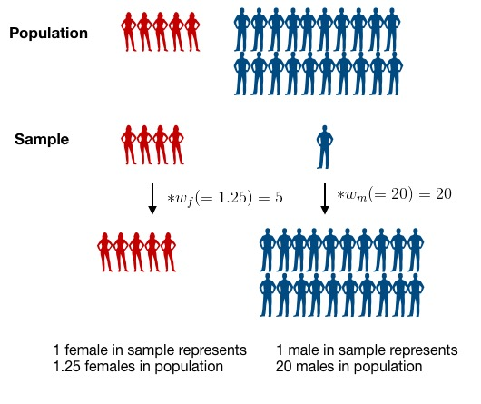

```{r setup, include=FALSE}
knitr::opts_chunk$set(echo = TRUE, message = FALSE, error = TRUE)
knitr::opts_knit$set(root.dir = "/cloud/project")
```

## Module 2: Factors that are associated with development of hypertension

Recall that our main questions of interest are:

  * Question 2.1: What factors measured in the NYC HANES survey are associated with having hypertension?
  * Question 2.2: How do our estimates from survey-weighted logistic regression differ from those where we ignore survey weights?


The learning objectives for this module include:

  * data cleaning/visualization
  * logistic regression
  * survey-weighted analysis
  * selection of survey weights for unbalanced data

## Reminder: What are the data?

For this case study, we will use data from the [New York City (NYC) Health and Nutrition Examination Survey (NYC HANES)](http://nychanes.org/){target="_blank"}, 
modeled on the 
[National Health and Nutrition Examination Survey (NHANES)](https://wwwn.cdc.gov/nchs/nhanes/default.aspx){target="_blank"}. NHANES is a population-based, cross-sectional study with data collected 
from a physical examination and laboratory tests, as well as a face-to-face 
interview and an audio computer-assisted self-interview (ACASI). It is 
designed to assess the health and nutritional status of adults and children 
in the United States. NYC HANES is a local version of NHANES, which implies 
it mainly focuses on New York area. 


## Learning objectives for today

Our main question of interest for this module is: Based on the data collected from NYC HANES, which risk factors play a role in development of hypertension?

Today, we will continue to work toward answering this by learning how to:

* Understand why we need to include survey weights in our analysis
* Discuss our initial data visualizations and how they relate to the question of interest for this module
* Learn about and see how to use tools designed for working with survey data in R 


## Data analysis concerns: model framework and survey weights

Now that we have spent some time cleaning the data and looking at 
data visualizations, we want to use a statistical 
model to address our question of interest about which 
factors are related to the risk of hypertension.

Which model should we use? Since we are looking 
at whether or not someone develops hypertension, our outcome
variable (`hypertension`) is **binary**. A binary outcome means a logistic regression model is a natural choice.  However, think of the nature of our dataset and how it was collected. It is data obtained from a survey, and we have to account for this during the analysis of the data.

In a survey sample, we often end up with "too many" samples in a category, often due to the designed sampling plan.  By "too many", we mean more than would be expected based on the make-up of the population from which we are sampling.  For example, we may have a much higher proportion of women in our sample compared to the population and a much lower proportion of men than in the population. This may happen by design if we purposely *oversample* a group that isn't well represented in the overall population.

To analyze our survey data and infer back to the population, we can use data weighting to account for the mismatch between the population and sample. If we want the data to reflect the whole population, instead of treating each data 
point equally, we weight the data so that taken together,
our sample does reflect the entire community.

To appropriately analyze our data as a survey, we will use the [package `survey`](https://cran.r-project.org/web/packages/survey/survey.pdf), which contains functions for various types of analysis that account for survey design.

## Survey weights 

### What are survey weights?

Suppose that we have 25 students (20 male and 5 female) in our biostatistics
class, and we want to talk with 5 of them to gauge their 
understanding of the content in the class. Although the proportion of female students in the population is small, we are very interested in getting their opinion, so we want to be sure to have some female students in our sample.  By randomly sampling 5 students 
from the class, it's quite possible we could end up with all male students in our sample, and we wouldn't learn anything about the female perspective in the class. 

Consider the extreme case where we are going to require that 4 of the 5 people we sample are female students, to be sure we get good information about the female perspective.  We sample 4 of the 5 female students and 1 of the 20 male students.   Do we expect this sample to represent the population? Definitely not, since there is a higher proportion of females in the sample than the population. We can 
correct for this by weighting our samples so that, taken together, 
they better reflect the composition of the population we want to learn about. 

Let's assume we sampled 4 of the 5 female students and 1 of the 20 male students from our population. To calculate the survey weights, we could use the following formula:

$$Weight = \frac{Proportion~in~population}{Proportion~in~sample}$$
$$w_m=Male~Weight = \frac{20/25}{1/25} = 20$$
$$w_f=Female~Weight = \frac{5/25}{4/25} = 1.25$$
We can interpret these weights by saying that each male student in the sample represents 20 male students in the population and each female student in the sample represents 1.25 female students in the population.  Mathematically, we can see this as:

$$ 1~observed~male* w_m = 20~males $$ 
and 
$$ 4~observed~females * w_f = 5~females$$ 

<center>

</center>

By weighting the observations, we make the sample better 
represent the population.

For complex survey sampling designs, it can be 
complicated to calculate the weight for each individual observation. However, for many large survey data sets, such as NHANES, the appropriate weight is calculated by the organization that administers the survey and provided as a variable in the dataset. In our case study, this survey weight is calculated and provided as the `surveyweight` variable and we can simply 
apply this weight and perform a **survey-weighted logistic regression**.

### Selecting the weights

Because the NYC HANES 2013-2014 data have been collected to 
address a variety of different questions and using different 
surveys, the researchers who produced the data have employed a 
somewhat complex weighting scheme to compensate for unequal 
probability of selection. Five sets of survey weights have been 
constructed to correspond to different sets of variables that were
collected: CAPI  weight, Physical weight, Blood Lab result weight,
Urine Lab results weight and Salica Lab results weight. 
**The determination of the most appropriate weight to use for a specific analysis depends upon the variables selected by the data analyst**. 

We will give a table to indicate each variable's origin stream:


| Variable names   |      Component      |
|---------------------------------|---------------------------------|
| age                                   | CAPI                                                                                                                                                                 |
| race                                  | CAPI                                                                                                                                                                 |
| gender                                | CAPI                                                                                                                                                                 |
| diet                                  | CAPI                                                                                                                                                                 |
| income                                | CAPI                                                                                                                                                                 |
| diabetes                               | CAPI                                                                                                                                                               |
| cholesterol                           | CAPI                                                                                                                                                                 |
| drink                                 | CAPI                                                                                                                                                                 |
| smoking                               | CAPI                                                                                                                                                                 |
| hypertension                           | CAPI                                                                                                                                                                |
| bmi                                    | EXAM                                                                                                                                                                |


When an analysis involves variables from different components
of the survey, the analyst should decide whether the outcome 
is inclusive or exclusive, and then choose certain weights. 
To learn how to use weights for different purposes, refer to the particular
[Analytics Guidelines](http://nychanes.org/wp-content/uploads/sites/6/2015/11/ANALYTIC-GUIDELINES-2016_V2.pdf) for the survey. 

In our case, we choose EXAM weight since our analysis is exclusive. Do 
you remember we have removed all of the missing values? Now our dataset is 
limited to those who received a physical exam test, which means all of our 
survey participants have a value for the `EXAM_WT` variable. We selected
this variable and renamed it as `surveyweight` in the earlier data 
cleaning part of this analysis. 

## Finite population correction factor

There is one more technical detail that we need to 
consider when using survey data. Many methods for analysis 
of survey data make the assumption that
**samples were collected using sampling with replacement**, 
i.e., any time a new participant is drawn, each member in the population has 
an equal chance of being sampled, even if they have 
already been sampled. This is not usually how surveys
are actually carried out, so an adjustment may be necessary
to reflect this difference. This adjustment is called the
**finite population correction factor** and it is defined as:

$$FPC = (\frac{N-n}{N-1})^{\frac{1}{2}}$$
 
* `N` = population size
* `n` = sample size

In the case when the assumption above is violated (e.g. if you 
are sampling a sufficiently large proportion of the population), 
then you might sample the same persion twice. The finite 
population correction (FPC) is used to reduce the variance when
a substantial fraction of the total population of interest has 
been sampled. We can find the value of `N` and `n` for our survey from the
[Analytics Guidelines](http://nychanes.org/wp-content/uploads/sites/6/2015/11/ANALYTIC-GUIDELINES-2016_V2.pdf){target="_blank"}. 
Next let's calculate the FPC as below:

```{r}
N <-  6825749
n <- 1500  ## this is just an approximation to our sample size since we have not read in the data yet
((N-n)/(N-1))^0.5
```

The FPC of our data set is very close to 1 since our sample is quite small compared to the size of the population, and we could simply ignore the FPC. But technically, since the data were
collected through sampling without replacement, 
it is more appropriate to use it.


## Your data visualizations

Start by loading libraries and raw data set.
```{r}
library(tidyverse)  # core group of tidyverse packages
library(knitr)  # to make nice tables
library(ggpubr)
library(ggrepel)
library(tidyverse)
library(kableExtra)
library(survey)
library(haven)
library(broom)
library(plotrix)

dat <- read_sas('Module2/data/d.sas7bdat')
dim(dat)
```


### Example 1


```{r select-cols}

hy_df <- 
  dat %>% 
    select(id = KEY,
           age = SPAGE,
           race = DMQ_14_1,
           gender = GENDER,
           diet = DBQ_1,
           income = INC20K,
           diabetes = DIQ_1,
           bmi = BMI,
           cholesterol = BPQ_16,
           drink = ALQ_1_UNIT,
           smoking = SMOKER3CAT,
           hypertension = BPQ_2,
           surveyweight = EXAM_WT)

hy_df <- hy_df %>% mutate(race=factor(race, levels=c(100, 110, 120, 140, 180, 250), 
                      labels=c('White', 'Black/African American', 
                              'Indian /Alaska Native', 
                              'Pacific Islander', 
                              'Asian', 'Other Race')),
                     gender = factor(gender, levels=c(1,2), 
                        labels=c('Male', 'Female')),
                     diet = factor(diet, levels=c(5:1), 
                      labels=c('Poor', 'Fair', 'Good', 
                               'Very good','Excellent')),
                     income = factor(income, levels=c(1:6), 
                        labels=c('Less than $20,000','$20,000 - $39,999',
                                 '$40,000 - $59,999','$60,000 - $79,999',
                                 '$80,000 - $99,999','$100,000 or more')),
                     diabetes = factor(diabetes, levels=c(2,1,3), 
                          labels=c('No','Yes','Prediabetes')),
                     cholesterol = factor(cholesterol, levels=c(2,1), 
                             labels=c('Low value','High value')),
                     drink = factor(drink, levels=c(4,1,2,3), 
                       labels=c('Never','Weekly', 'Monthly', 'Yearly')),
                     smoking = factor(smoking, levels=c(3:1), 
                         labels=c('Never smoker','Former smoker','Current smoker')),
                     hypertension = factor(hypertension, levels=c(2,1), 
                              labels=c('No','Yes'))
                     )

hy_p_df <- 
  hy_df %>%
  drop_na()

p1 <- hy_p_df %>% 
        ggplot(aes(x = hypertension, y = age)) +
          geom_boxplot() + 
          ggtitle('Distribution of age by hypertension status')

p2 <- hy_p_df %>% 
        ggplot(aes(x = hypertension, y = bmi)) +
          geom_boxplot() + 
          ggtitle('Distribution of bmi by hypertension status')

p3 <- hy_p_df %>% 
        ggplot(aes(x = hypertension, y = surveyweight)) +
          geom_boxplot() + 
          ggtitle('Distribution of weight by hypertension status')

ggarrange(p1, p2, p3,  ncol=2, nrow=2)

```

My display looks at the relationship between hypertension and the three non categorial variables age, bmi, and surveyweight. By comparing the medians of the boxplots, it is clear that age and bmi are most related to hypertensions. People who are hypertense are older and have a higher bmi than people who are not hypertense. The medians for surveyweight are pretty close so surveyweight is not as related to hypertension as age or bmi.


### Example 2

```{r}
# Select and rename variables
my_data <- dat %>% 
    select(id = KEY,
           age = SPAGE,
           race = RACE,
           gender = GENDER,
           income = INC20K,
           usborn = BORN,
           bmi = BMI,
           distress = DISTRESS,
           insured = HIQ_1,
           hypertension = BPQ_2,
           surveyweight = EXAM_WT)

# Adjust data types
my_data <- my_data %>% 
  mutate(race=factor(race, levels=c(1,2,3,4,5), labels = c('Non-Hispanic White', 'Non-Hispanic Black', 'Hispanic', 'Asian', 'Other')),
         gender = factor(gender, levels=c(1,2), labels = c('Male', 'Female')),
         income = factor(income, levels=c(1:6), labels=  c('Less than $20,000','$20,000 - $39,999', '$40,000 - $59,999','$60,000 - $79,999', '$80,000 - $99,999','$100,000 or more')),
         usborn = factor(usborn, levels=c(1,2), labels = c('US-Born, States and DC', 'Other country')),
         distress = factor(distress, levels=c(2,1), labels = c('No distress', 'Distress')),
         insured = factor(insured, levels=c(1,2), labels = c('Insured', 'Uninsured')),
         hypertension = factor(hypertension, levels=c(2,1), 
                              labels=c('No hypertension','Hypertension')))
                         
### put code to create data display here
p1 <- subset(my_data, !is.na(hypertension)) %>% 
        ggplot(aes(x = hypertension, y = bmi)) +
          geom_boxplot() + 
          labs(title = "Distribution of BMI",
               subtitle = "by hypertension status")

p2 <- subset(my_data, !is.na(usborn) & !is.na(hypertension)) %>% 
        ggplot(aes(x = usborn, fill = hypertension)) + 
          geom_bar(position = "fill") + 
          labs(title = "Distribution of hypertension",
               subtitle = "by country of birth",
               x = "Birth country",
               y = "Proportion") +
          theme(axis.text.x = element_text(angle = 45, size=8, hjust=1))

p3 <- subset(my_data, !is.na(distress) & !is.na(hypertension)) %>% 
        ggplot(aes(x = distress, fill = hypertension)) + 
          geom_bar(position = "fill") + 
          labs(title = "Distribution of hypertension",
               subtitle = "by distress status",
               x = "Distress status",
               y = "Proportion")

p4 <- subset(my_data, !is.na(insured) & !is.na(hypertension)) %>% 
        ggplot(aes(x = insured, fill = hypertension)) + 
          geom_bar(position = "fill") + 
          labs(title = "Distribution of hypertension",
               subtitle = "by health insurance status",
               x = "Health insurance status",
               y = "Proportion")

p5 <- subset(my_data, !is.na(income) & !is.na(hypertension)) %>% 
        ggplot(aes(x = income, fill = hypertension)) + 
          geom_bar(position = "fill") + 
          labs(title = "Distribution of hypertension",
               subtitle = "by income",
               x = "Income",
               y = "Proportion")+
          theme(axis.text.x = element_text(angle = 45, size=8, hjust=1))

ggarrange(p2, p3, p4, p5, ncol=2, nrow=2)

```


From this display, we see that hypertension affects a greater proportion of foreign-born compared to U.S. born individuals, not distressed compared to distressed individuals, and insured compared to uninsured individuals. We also see that there is a rough downward trend in the proportion of individuals with hypertension with respect to income, though the $60,000-79,999 and the highest income category seem to be exceptions.


### Example 3

```{r}
### put recoding data here
### you can use comments like this to describe what you are doing
#Renaming 13 variables for potential analysis
hy_df <- 
  dat %>% 
    select(id = KEY,
           age = SPAGE,
           race = DMQ_14_1,
           gender = GENDER,
           diet = DBQ_1,
           income = INC20K,
           diabetes = DIQ_1,
           bmi = BMI,
           cholesterol = BPQ_16,
           drink = ALQ_1_UNIT,
           smoking = SMOKER3CAT,
           hypertension = BPQ_2,
           surveyweight = EXAM_WT)
#Getting rid of NA values 
hy_df <- hy_df %>% 
          mutate(drink = ifelse(dat$ALQ_1 == 0, 4, drink))

#Adjusting Data Types
hy_df <- hy_df %>% mutate(race=factor(race, levels=c(100, 110, 120, 140, 180, 250), 
                      labels=c('White', 'Black/African American', 
                              'Indian /Alaska Native', 
                              'Pacific Islander', 
                              'Asian', 'Other Race')),
                     gender = factor(gender, levels=c(1,2), 
                        labels=c('Male', 'Female')),
                     diet = factor(diet, levels=c(5:1), 
                      labels=c('Poor', 'Fair', 'Good', 
                               'Very good','Excellent')),
                     income = factor(income, levels=c(1:6), 
                        labels=c('Less than $20,000','$20,000 - $39,999',
                                 '$40,000 - $59,999','$60,000 - $79,999',
                                 '$80,000 - $99,999','$100,000 or more')),
                     diabetes = factor(diabetes, levels=c(2,1,3), 
                          labels=c('No','Yes','Prediabetes')),
                     cholesterol = factor(cholesterol, levels=c(2,1), 
                             labels=c('Low value','High value')),
                     drink = factor(drink, levels=c(4,1,2,3), 
                       labels=c('Never','Weekly', 'Monthly', 'Yearly')),
                     smoking = factor(smoking, levels=c(3:1), 
                         labels=c('Never smoker','Former smoker','Current smoker')),
                     hypertension = factor(hypertension, levels=c(2,1), 
                              labels=c('No','Yes'))
                     )
summary(hy_df)
#Getting rid of NA values
hy_p_df <- 
  hy_df %>%
  drop_na()

dim(hy_p_df)

### put code to create data display here
p1 <- hy_p_df %>% 
        ggplot(aes(x = gender, fill = hypertension)) + 
          geom_bar(position = "fill") + 
          facet_wrap(diet~cholesterol) +
          ggtitle('Distribution of Hypertension: Grouped by Sex, Diet, and Cholesterol value') + 
          ylab('proportion')
p1
```

The bar graphs shows how Sex, Diet, and Cholesterol value could be related to higher risk of hypertension. Their seems to be a connection between high cholesterol and higher risk of hypertension. The risk of hyperstension also appears higher in those with a poor diet, and decreases as the diet improves till it's excellent. Their isn't an obvious difference in hypertension risk with regards to sex, only small discrepancies in particular groups. The highest risk of hypertension appears in those with a poor diet, high cholesterol value, and are female. 

### Example 4

```{r, warning=FALSE}
### put recoding data here
### created a dataframe to store selected variables from the NYC HANES dataset
ny_df <- dat %>%
  select(id = KEY,
         hypertension = BPQ_2,
         surveyweight = EXAM_WT,
         gender = GENDER,
         age = SPAGE,
         race = RACE,
         highchol = BPQ_16,
         asthma = MCQ_1,
         famdiab = MCQ_17,
         diabetes = DIQ_1,
         diet = DBQ_1,
         physact = PAQ_1,
         smoking = SMOKER3CAT,
         drink = ALQ_1_UNIT,
         income = INC20K,
         bmi = BMI,
         pov = POVGROUP6_0812)

### If there are categories with high numbers of NA, ensure that the NAs are present for a reason
### Two variables have particularly high numbers of NA - Drink (412 NA) and Income (161 NA)

### With Drink, those who replied that they did NOT drink (ALC_1 = 0, they were not asked AlQ_1_UNIT)
ny_df <- ny_df %>%
  mutate(drink = ifelse(dat$ALQ_1 == 0, 4, drink))

### INC20K doesn't seem to indicate a reason as to why there are 161 missing data points


### Recoding categorical selected variables taken from the HANES Data 
ny_df <- ny_df %>%
  mutate(
    race = factor(race, levels=c(1, 2, 3, 4, 5), labels=c("Non-Hispanic White", "Non-Hispanic Black", "Hispanic", "Asian", "Other")),
    hypertension = factor(hypertension, levels=c(1, 2), labels = c("Yes", "No")),
    gender = factor(gender, levels=c(1, 2), labels=c("Male", "Female")),
    highchol = factor(highchol, levels=c(1, 2), labels=c("High", "Not High")),
    asthma = factor(asthma, levels=c(1, 2), labels=c("Yes", "No")),
    famdiab = factor(famdiab, levels=c(1, 2), labels=c("Yes", "No")),
    diabetes = factor(diabetes, levels=c(1, 2, 3), labels=c("Yes", "No", "Prediabetes")),
    diet = factor(diet, levels=c(1, 2, 3, 4, 5), labels=c("Excellent", "Very Good", "Good", "Fair", "Poor")),
    physact = factor(physact, levels=c(1, 2, 3, 4), labels=c("Very Active", "Somewhat", "Not Very", "Not At All")),
    smoking = factor(smoking, levels=c(1, 2, 3), labels=c("Never Smoker", "Current Smoker", "Former Smoker")),
    drink = factor(drink, levels=c(1, 2, 3, 4), labels=c("Week", "Month", "Year", "None")),
    income = factor(income, levels=c(1, 2, 3, 4, 5, 6), labels=c("<20000", "20000-39999", "40000-59999", "60000-79999", "80000-99999", ">=100000")),
    pov = factor(pov, levels=c(1, 2, 3, 4, 5, 6), labels=c("0 to <5%", "5 to <10%", "10 to <20%", "20 to <30%", "30 to <40%", "40 to 100%"))
  )

### put code to create data display here
### Bar plot - grouped by hypertension, plotting diabetes, physical activity, and High Cholesterol
hyperf1 <- ny_df %>%
  group_by(highchol, diabetes, physact, gender) %>%
  count(highchol, diabetes, physact, hypertension, gender) %>%
  mutate(prop=n/sum(n)) %>%
  filter(hypertension == "Yes") %>%
  filter(gender == "Female") %>%
  drop_na(highchol, physact)

bar1 <- ggplot(data = hyperf1) +
  geom_bar(mapping = aes(x = highchol, y = prop, group = hypertension, fill = hypertension), stat = "identity", fill = "#FF67A4") +
    labs(title = "Hypertension Among Females by Diabetes, Cholesterol, Physical Activity", y = "Proportion", x = "Cholesterol") + 
    facet_grid(physact ~ diabetes)

hyperm1 <- ny_df %>%
  group_by(highchol, diabetes, physact, gender) %>%
  count(highchol, diabetes, physact, hypertension, gender) %>%
  mutate(prop=n/sum(n)) %>%
  filter(hypertension == "Yes") %>%
  filter(gender == "Male") %>%
  drop_na(highchol, physact)

bar2 <- ggplot(data = hyperm1) +
  geom_bar(mapping = aes(x = highchol, y = prop, group = hypertension, fill = hypertension), stat = "identity", fill = "#619CFF") +
    labs(title = "Hypertension Among Males by Diabetes, Cholesterol, Physical Activity", y = "Proportion", x = "Cholesterol") + 
    facet_grid(physact ~ diabetes)

ggarrange(bar1, bar2, ncol = 2, nrow = 1)
```

\
The graphical display above consists of two side-by-side bar plots plotting hypertension by diabetes, cholesterol, and physical activity among females and males, respectively. While there were numerous other variables that could contribute to a significant association with hypertension, it would be difficult to plot them all in a single figure.
\
\
From the two plots, there does not seem to be a discernable relationship between gender and hypertension - for males and females without diabetes the proportion of each with hypertension were almost equal. The same is true for very active males and females with diabetes. 
\
\
The presence of diabetes or prediabetes seems to be associated with hypertension. Both males and females without diabetes for all activity and cholesterol levels had lower proportions with hypertension when compared to otherwise similar males and females with diabetes or prediabetes. From the data provided, males and females with diabetes also seem to have higher proportions of hypertension compared to otherwise similar males and females with prediabetes, but this relationship is unclear as there isn't enough data on males and females with prediabetes.
\
\
Cholesterol levels also seem to be associated with hypertension. In males there is a clear relationship between cholesterol levels and hypertension - males with high cholesterol had higher proportions of hypertension compared to otherwise similar males without high cholesterol, with the only exception being very active males with diabetes. For females the relationship is less clear - for all females without diabetes high cholesterol contributed to a higher proportion of hypertension, but relative proportions of hypertension among females with diabetes varied. Somewhat active females and females who were not active at all experienced higher proportions of hypertension among otherwise similar females with high cholesterol compared to otherwise similar females without high cholesterol, but the trend is reversed for very active and not very active females, with lower proportions of hypertension among otherwise similar females with high cholesterol compared to otherwise similar females without high cholesterol.
\
\
This could indicate that diabetes could have a confounding effect on the relationship between cholesterol levels and hypertension.
\
\
The final variable graphed was physical activity. For both males and females, there does not appear to be a strong association between the level of physical activity and hypertension.
\
\

```{r}
ny_df %>%
  group_by(highchol, diabetes, physact, gender) %>%
  count(highchol, diabetes, physact, hypertension, gender) %>%
  print(n=Inf)
```

### Example 5

```{r}

hy_df <- 
  dat %>% 
    select(id = KEY,
           age = SPAGE,
           race = DMQ_14_1,
           gender = GENDER,
           diet = DBQ_1,
           income = INC20K,
           diabetes = DIQ_1,
           bmi = BMI,
           cholesterol = BPQ_16,
           drink = ALQ_1_UNIT,
           smoking = SMOKER3CAT,
           hypertension = BPQ_2,
           surveyweight = EXAM_WT)

hy_df <- hy_df %>% mutate(race=factor(race, levels=c(100, 110, 120, 140, 180, 250), 
                      labels=c('White', 'Black/African American', 
                              'Indian /Alaska Native', 
                              'Pacific Islander', 
                              'Asian', 'Other Race')),
                     gender = factor(gender, levels=c(1,2), 
                        labels=c('Male', 'Female')),
                     diet = factor(diet, levels=c(5:1), 
                      labels=c('Poor', 'Fair', 'Good', 
                               'Very good','Excellent')),
                     income = factor(income, levels=c(1:6), 
                        labels=c('Less than $20,000','$20,000 - $39,999',
                                 '$40,000 - $59,999','$60,000 - $79,999',
                                 '$80,000 - $99,999','$100,000 or more')),
                     diabetes = factor(diabetes, levels=c(2,1,3), 
                          labels=c('No','Yes','Prediabetes')),
                     cholesterol = factor(cholesterol, levels=c(2,1), 
                             labels=c('Low value','High value')),
                     drink = factor(drink, levels=c(4,1,2,3), 
                       labels=c('Never','Weekly', 'Monthly', 'Yearly')),
                     smoking = factor(smoking, levels=c(3:1), 
                         labels=c('Never smoker','Former smoker','Current smoker')),
                     hypertension = factor(hypertension, levels=c(2,1), 
                              labels=c('No','Yes'))
                     )


hy_p_df <- 
  hy_df %>%
  drop_na()

dim(hy_p_df)

p1 <- hy_p_df %>% 
        ggplot(aes(x = smoking, fill = hypertension)) + 
          geom_bar(position = "fill") + 
          facet_grid(gender~income) +
          ggtitle('distribution of hypertension') + 
          ylab('proportion')
p1

```

My display shows that males tend to have higher rates of hypertension in most areas when they have identical income and smoking status. It also seems to show that people who have never smoked seem to have a higher rate of hypertension than current smokers or people that have ever smoked. 

```{r}
p2 <- hy_p_df %>% 
        ggplot(aes(x = smoking, fill = hypertension)) + 
          geom_bar(position = "fill") +
          ggtitle('distribution of hypertension') + 
          ylab('proportion')
p2

```

### Example 6

```{r}
### put recoding data here
### you can use comments like this to describe what you are doing

### selecting and renaming variables
hy_df <- 
  dat %>% 
    select(id = KEY,
           age = SPAGE,
           race = DMQ_14_1,
           gender = GENDER,
           diet = DBQ_1,
           bmi = BMI,
           education = EDU4CAT,
           marital = MARITAL,
           general_health = HSQ_1,
           hypertension = BPQ_2,
           )

### numeric to descriptive categories
hy_df <- hy_df %>% 
  mutate(education = factor(education, 
                          levels = c("1", "2", "3", "4", "5"), 
                          labels = c("< HS", 
                                     "HS/GED", 
                                     "Some College", 
                                     "College Grad +",
                                     "Other")),
         marital = factor(marital, 
                          levels = c("1", "2", "3"),
                          labels =c("Never married or Single",
                                    "Married or Living with partner",
                                    "Widowed, Divorced, or Separated")),
         race = factor(race,
                       levels = c("100", "110", "120", "140",
                                  "180", "250"),
                       labels = c("White",
                                  "Black/African American",
                                  "Indian/Alaska Native",
                                  "Native Hawaiian/Pacific Islander",
                                  "Asian",
                                  "Other")),
         general_health = factor(general_health,
                                 levels = c("1", "2", "3", "4",
                                            "5"), 
                                 labels = c("Excellent",
                                            "Very good",
                                            "Good", "Fair",
                                            "Poor")),
         gender = factor(gender, 
                         levels = c("1", "2"),
                         labels = c("Male", "Female")),
         diet = factor(diet,
                       levels = c("1", "2", "3", "4",
                                            "5"), 
                       labels = c("Excellent", "Very good",
                                  "Good", "Fair", "Poor")),
         hypertension = factor(hypertension,
                               levels = c("1", "2"),
                               labels = c("Yes", "No"))
  )

health_tab <- hy_df %>%
  group_by(general_health) %>%
  count(general_health, hypertension) %>%
  mutate(prop=n/sum(n)) %>%
  filter(hypertension == "Yes")


### put code to create data display here

ggplot(data = hy_df) + 
  geom_bar(aes(x = general_health, fill = hypertension), position = "fill") + 
  ggtitle('distribution of hypertension across self-reported health status') + ylab('proportion')

ggplot(data = hy_df) + 
  geom_bar(aes(x = diet, fill = hypertension), position = "fill") + 
  ggtitle('distribution of hypertension across self-reported diet groups') + ylab('proportion')


```

The first display examines the distribution of hypertension among groups of "excellent", "very good", "good", "fair", or "poor" health as evaluated by the survey participants. As the graph shows, there does seem to be a negative correlation between reporting positively in terms of health and hypertension. It would be interesting to determine if a participant's potential stress over poor health could be associated with hypertension, but it does not appear that it is possible to see in this data set.

### Some points of discussion

What surprising relationships did you see in your displays? Were there some counter-intuitive patterns? What might be causing these? How might you investigate this?

How would you go about looking for interactions between variables?


## Incorporating survey weights into our analysis

We will read in and recode the data, as we did last week. 

```{r read-data}
hy_df <- 
  dat %>% 
    select(id = KEY,
           age = SPAGE,
           race = DMQ_14_1,
           gender = GENDER,
           diet = DBQ_1,
           income = INC20K,
           diabetes = DIQ_1,
           bmi = BMI,
           cholesterol = BPQ_16,
           drink = ALQ_1_UNIT,
           smoking = SMOKER3CAT,
           hypertension = BPQ_2,
           surveyweight = EXAM_WT)

hy_df <- hy_df %>% 
          mutate(drink = ifelse(dat$ALQ_1 == 0, 4, drink))

hy_df <- hy_df %>% mutate(race=factor(race, levels=c(100, 110, 120, 140, 180, 250), 
                      labels=c('White', 'Black/African American', 
                              'Indian /Alaska Native', 
                              'Pacific Islander', 
                              'Asian', 'Other Race')),
                     gender = factor(gender, levels=c(1,2), 
                        labels=c('Male', 'Female')),
                     diet = factor(diet, levels=c(5:1), 
                      labels=c('Poor', 'Fair', 'Good', 
                               'Very good','Excellent')),
                     income = factor(income, levels=c(1:6), 
                        labels=c('Less than $20,000','$20,000 - $39,999',
                                 '$40,000 - $59,999','$60,000 - $79,999',
                                 '$80,000 - $99,999','$100,000 or more')),
                     diabetes = factor(diabetes, levels=c(2,1,3), 
                          labels=c('No','Yes','Prediabetes')),
                     cholesterol = factor(cholesterol, levels=c(2,1), 
                             labels=c('Low value','High value')),
                     drink = factor(drink, levels=c(4,1,2,3), 
                       labels=c('Never','Weekly', 'Monthly', 'Yearly')),
                     smoking = factor(smoking, levels=c(3:1), 
                         labels=c('Never smoker','Former smoker','Current smoker')),
                     hypertension = factor(hypertension, levels=c(2,1), 
                              labels=c('No','Yes'))
                     )

## remove entries with missing data
hy_p_df <- 
  hy_df %>%
  drop_na()

```

## Specify the survey design

We now need to figure out how to specify the survey design 
and incorporate the sampling weights in our modeling steps. 
To help us do this, we use the function `svydesign()` in 
[package `survey`](https://cran.r-project.org/web/packages/survey/survey.pdf).
This function combines a data frame and all the design information needed to specify 
a survey design. Here is the list of options provided 
in this function:

* `ids`: Formula used to specify the cluster sampling design. *Cluster sampling* is a multi-stage sampling design where the total population is divided into several clusters and a simple random sample of clusters is selected. Then a sample is taken from the elements of each selected cluster. Use `~0` or `~1` as the formula when there are no clusters.

* `data`: Data frame (or database table name) containing the variables for analysis look up variables in the formula arguments.

* `weights`: Formula or vector specifying the sampling weights. 

* `fpc`: Finite population correction, `~rep(N,n)`  generates a vector of length n where each entry is N (the population size). Default value is 1. The use of fpc indicates a sample without replacement, otherwise the default is a sample with replacement.
 
* `strata`: Specification for stratified sampling.  *Stratified sampling* is a sampling design which divides members of the population into homogeneous subgroups and then samples independently in these subpopulations. It is advantageous when subpopulations within an overall population vary.
 
In our situation, we don't have any clusters or stratified sampling to specify, we just need to include the appropriate survey weights provided with the data.  We will not include a FPC, since our FPC was approximately 1.
 
Here's how we specify the design relative to our dataset:

```{r}
hypertension_design <- svydesign(
  id = ~1,
  #fpc = ~rep(N,n),
   weights = ~hy_p_df$surveyweight,
  data = hy_p_df
)
```


The arguments are interpreted as the following:

* `ids = ~1` means there is no cluster sampling
* `data = hy_df` tells `svydesign` where to find the variables for analysis
* `weights= ~hy_df$surveyweight` tells it where to find the weight in our data frame

We can use `summary()` to show the results:
```{r}
summary(hypertension_design)
```

"Independent sampling design" means our sampling design is a 
simple random sample (SRS). By setting other parameters 
it is possible to specify different kinds of designs, such as 
stratified sampling, cluster sampling, or other multi-stage designs.


## Calculate survey-weighted summary statistics

Once we have created our `svydesign` object, we can use the
convenient `svy*` functions to calculate summary statistics that
account for survey design features.

To calculate the mean and its standard error, use the function 
`svymean()`. The `svymean()` function calculates a weighted estimate for the mean by weighting each observation with it's sampling weight.
We can compare this result to ignoring the survey weights using the
`mean()` and `std.error()` functions in base R.

Here we look at both the weighted and un-weighted mean BMI:

```{r}
svymean(~bmi, hypertension_design)
```
```{r}
mean(hy_p_df$bmi)
std.error(hy_p_df$bmi)
```

There is not a very large difference between 
these two values and their standard errors.  However, the survey-weighted results are "better" because they account for the sampling design of the HANES NYC survey.

To calculate a survey-weighted confidence interval for mean BMI value, we use the 
function `confint()` directly on the `svymean()` function:

```{r}
confint(svymean(~bmi, hypertension_design))
```

Statistics for subgroups are also easy to calculate with the
function `svyby()`.  Here we look at mean BMI within groups defined by diet quality.
```{r}
svyby(~bmi, by=~diet, design = hypertension_design, 
      FUN = svymean)
```

If we are particularly interested in one subgroup of individuals, 
we can use the `subset()` to define a design for our subgroup of interest.  For example, if we are only interested in learning about the female population:
```{r}
h_design_female <- subset(hypertension_design,gender=="Female")
svymean(~bmi, h_design_female)
```

We estimate that the mean BMI for females in the population is 28.1.

Note that if we are limiting our analysis to a subgroup of the data, we **must** use the subset command to define a new survey design that relates to this new subpopulation.  This is because the survey weights need to be updated to reflect how the data represents this new population.  The `subset` command will appropriately update the survey weights so the analysis reflects the survey design of the subsetted data.  We **cannot** simply use a subset of the data with the original survey design.


## Survey-weighted logistic regression

### Fit a simple model

Logistic regression is widely used to when the response variable is binary.  The standard logistic regression equation can be written as:

$logit(p)= log(\frac{p}{1-p})=X^{T}\beta$, where $p=P(Y=1)=E(Y)$ 

As we mentioned above, our data comes from a survey design so we need to take survey weights into account in our analysis.  We can do that with a survey-weighted logistic regression using the `svyglm()` function from the `survey` package.

The `svyglm()` function works similarly to using `glm()` to fit a standard logistic regression model.  The only difference is that instead of using the original data set in the `data` argument within `glm()`, we instead input the survey design object from `svydesign()` in the `design` argument in `svyglm()`.

Now we can fit our survey-weighted logistic regression model and 
look at the summarized output. We will start with a simple
model by choosing one variable, `smoking`, as a predictor:

```{r, warning=TRUE}
g <- svyglm(hypertension ~ smoking, 
    family = binomial(link = 'logit'), design = hypertension_design)
summary(g)
```

If we allow `warning = TRUE`, a warning would appear as "non-integer #successes in a binomial glm!". But everything is right here! `glm` and `svyglm` are just picky. They warn if they detect that the no. of trials or successes is non-integral, but they go ahead and fit the model anyway. If you want to suppress the warning (and you're sure it's not a problem), use `family=quasibinomial()` instead.

```{r, warning=TRUE}
g0 <- svyglm(hypertension ~ smoking, 
    family = quasibinomial(link = 'logit'), design = hypertension_design)
summary(g0)
```


The `tidy()` function in the `broom` package can provide a dataframe 
representation of the model's output. Now we can see the model output as a nice dataframe!

```{r}
g_res <- tidy(g0)
g_res
```

As in standard logistic regression using `glm()`, we see the coefficient estimate, standard error, test statistic, and p-value for each term in our model.  We can still get survey-weighted confidence intervals with the `confint()` function:
```{r}
confint(g0)
```


What does the model output tell us about the relationship 
between predictor variables and the chance of getting hypertension? 
Look at the coefficient table. For the predictor variable `smoking`, the
reference category is 'Never smoker'. So the coefficient for 'Former Smoker', `r g_res$estimate[2]`, tells us that the log odds of hypertension for a former smoker is 0.58 lower than for a never smoker.  It makes more sense to exponentiate the coefficients and interpret them as odds ratios:
```{r}
exp(g0$coefficients)
```

The exponentiated coefficient for 'Former smoker' is `r exp(g_res$estimate)[2]`, 
which means that former smokers have a 44% reduced odds of hypertension compared to never smokers. Similarly, the exponentiated coefficient for 'Current smoker' is `r exp(g_res$estimate)[3]`, meaning current smokers have a 31% reduction in the odds of hypertension compared to those who have never smoker.  What's more, we can see the 
p-values are less than 0.05 for both of these coefficients, suggesting 
these odds ratios are significantly different than 1.


### Fit a full model

Now we can fit a full model that includes all of our variables of interest: 

```{r}
g1 <- svyglm(hypertension ~ 
               age + race + gender + diet + income + 
               diabetes + bmi + cholesterol + drink + smoking,
             family = binomial(link = 'logit'), 
             design = hypertension_design)
g1_res <- tidy(g1)
g1_res %>% as.data.frame()
```

One interesting thing is that both 
the coefficients and p-values for the `smoking` variables are different than in our simple model.  Why did this happen? Remember that with other variables in the model, our interpretation of the coefficients for smoking changes.  We now have to interpret them as describing the relationship between smoking and hypertension *while holding the other variables in the model constant.*  If the other variables in the model are also related to `smoking`, then the relationship between smoking and hypertension may be different once we account for the other variables compared to the relationship of smoking on its own.

Now, let's interpret the new output. Again, we will interpret exponentiated coefficients as odds ratios.  One categorical
variable and one continuous variable are chosen as examples:

```{r}
exp(g1$coefficients)
```

* `smoking`: Holding all other variables constant, former smokers have 40% reduced odds of hypertension compared to those who have never smoked.  Holding all other variables constant, current smokers have 20% reduced odds of hypertension compared to those who have never smoked.

* `bmi`: Holding all other variables constant, a one-unit increase in bmi 
is associated with a 7% increase in the odds of hypertension.

### Looking ahead to next week: Model selection

Not all of the variables in our full model `g1` are considered statistically significant so we would perhaps
like to remove some of them to get a reduced model. Next week we will discuss approaches we can take to address this concern.

## Assignment 2.2

Refine your data display from last week with the NYC HANES data to answer Question 2.1: What factors measured in the NYC HANES survey are associated with having hypertension?

Use the `svydesign()` function to create an appropriate survey-weighted data set to use for your modeling analysis. You will need to be sure to include a variable with the appropriate survey weights in your data set.

Use the `svyglm()` function to fit a logistic regression model, with hypertension as the outcome, to begin to explore the relationships among the variables in your data set in a modeling framework. You may want to consider the variables you include based on your data visualizations or other reasons. Write a few sentences interpreting the outputs of your model. (If you included many variables, you don't need to write about all of them here.)

* Submit your data display and the code for your initial survey-weighted analysis in R Markdown through Github by Sunday (March 8, 2020) at midnight.
* You may work together on this assignment, but you must submit your own data display; please credit in your assignment anyone with whom you collaborated.
* Next week in class we will continue with discussion/critiques of your displays and brainstorm as a class on ideas to improve these displays, discuss the intial outputs of your survey-weighted logistic regression, and start talking about variable selection.

