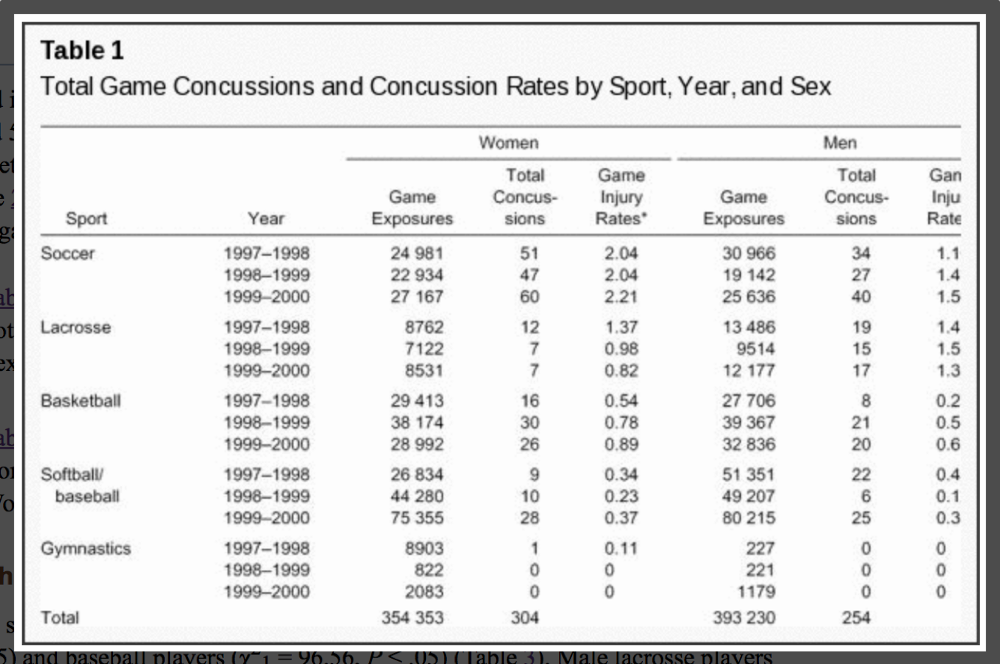

```{r setup, include=FALSE}
knitr::opts_chunk$set(echo = TRUE)
knitr::opts_knit$set(root.dir = "/cloud/project")
```

Poisson regression is a useful modeling tool when the outcome variable, $Y$, is a count, or number of events. It's appropriate when $Y$ has a Poisson distribution, which is often an appropriate distributional assumption for count variables.

These notes will give you a rough idea of how Poisson regression works and how to fit the Poisson regression model using `R`.

## Model equation

We write the model equation for Poisson regression as:
$$
\log (Y) = \beta_0 + \beta_1 \cdot X_1 + \beta_2 \cdot X_2 + ... + \beta_p\cdot X_p
$$
Because we model the $\log$ of the outcome variable, this is sometimes also called a *log-linear* model. **Note:** As in logistic regression, this is the *natural log* function not the log base 10 function.

## Interpreting coefficients

How would we interpret the coefficients in a Poisson regression model?  

* $\beta_0$ represents the $log(Y)$ when all the $X$ variables are 0.
* $\beta_1$ represents the change in $log(Y)$ associated with a one-unit increase in $X_1$, holding the other $X$ variables constant.
* $\beta_2$ represents the change in $log(Y)$ associated with a one-unit increase in $X_2$, holding the other $X$ variables constant.
* Etc

Just like in logistic regression, we can exponentiate these coefficients to get them off the log scale:

* $e^{\beta_0}$ represents the $Y$ when all the $X$ variables are 0.  So the *count* of events when all the $X$ variables are 0.
* $e^{\beta_1}$ represents the ratio of $Y$ values associated with a one-unit increase in $X_1$, holding the other $X$ variables constant.  So the ratio of *counts* associated with a one-unit increase in $X_1$, holding the other $X$ variables constant.
* $e^{\beta_2}$ represents the ratio of $Y$ values associated with a one-unit increase in $X_2$, holding the other $X$ variables constant. So the ratio of *counts* associated with a one-unit increase in $X_2$, holding the other $X$ variables constant.
* Etc

Why do we get ratios of $Y$ values here?  Just like in logistic regression, when log at a different in logs, this becomes a log of a ratio:
$$
\beta_1 = \log(Y | X_1 = x + 1) - \log(Y | X_1 = x) = log\left( \frac{Y | X_1 = x+1}{Y | X_1 = x} \right)
$$
So when we exponentiate we get:
$$
e^{\beta_1} = \frac{Y | X_1 = x+1}{Y | X_1 = x}
$$

## Working with rates instead of counts

Often when out outcome variable is a count (number of events), we aren't really interested in the *number* of events but are really interested in the *rate* of events.  For example, if we are interested in comparing infant deaths across mother's racial groups in the US, we don't want to compared the *count* of deaths for white mothers to the *count* of infant deaths for asian mothers, because there are more infants born to white mothers in the US than born to asian mothers in the US.  We would rather compare the *rate* of deaths for white mothers to the *rate* of infant deaths for asian mothers.  To do this, we need to account for the denominator in the rate calculation.  This denominator represents the *number of people* or the *person-time* at risk for the event to happen.  This is often the size of the population of the group where the events are counted.

To model *rates* instead of *counts*, we include an **offset** term in our model equation:
$$
\log (Y) = \log(N) + \beta_0 + \beta_1 \cdot X_1 + \beta_2 \cdot X_2 + ... + \beta_p\cdot X_p
$$
This $\log(N)$ term is called the offset, where $N$ is either the number at risk of the person-time at risk.  When we include the offset in the equation, we can rearrange the equation to get:
$$
\begin{eqnarray}
\log (number \ of \ events) &=& \log(N) + \beta_0 + \beta_1 \cdot X_1 + \beta_2 \cdot X_2 + ... + \beta_p\cdot X_p \\
\log (Y) &=& \log(N) + \beta_0 + \beta_1 \cdot X_1 + \beta_2 \cdot X_2 + ... + \beta_p\cdot X_p \\
\log (Y) - \log(N) &=& \beta_0 + \beta_1 \cdot X_1 + \beta_2 \cdot X_2 + ... + \beta_p\cdot X_p \\
\log \left(\frac{Y}{N} \right) &=& \beta_0 + \beta_1 \cdot X_1 + \beta_2 \cdot X_2 + ... + \beta_p\cdot X_p \\
\log (rate \ of \ events) &=& \beta_0 + \beta_1 \cdot X_1 + \beta_2 \cdot X_2 + ... + \beta_p\cdot X_p \\
\end{eqnarray}
$$
Now that the left-hand side of the equation is the $\log (rate \ of \ events)$, we can interpret the coefficients as follows:

* $\beta_0$ represents the $log(rate)$ when all the $X$ variables are 0.
* $\beta_1$ represents the change in $log(rate)$ associated with a one-unit increase in $X_1$, holding the other $X$ variables constant.
* $\beta_2$ represents the change in $log(rate)$ associated with a one-unit increase in $X_2$, holding the other $X$ variables constant.
* Etc

Now when we exponentiate these coefficients to get them off the log scale we get:

* $e^{\beta_0}$ represents the *rate* of events when all the $X$ variables are 0.
* $e^{\beta_1}$ represents the *rate ratio* associated with a one-unit increase in $X_1$, holding the other $X$ variables constant.
* $e^{\beta_2}$ represents the *rate ratio* associated with a one-unit increase in $X_2$, holding the other $X$ variables constant.
* Etc

We can interpret these *rate ratios* like we do the *odds ratios* we get from logistic regression.  For example, if the rate ratio (exponentiated coefficient) for a variable age, in years, is 1.8 we say: The rate of events is 80% higher for each additional year of age.  

## Example: Concussions by sex and sport

**Are there differences in concussion rates between male and female college athletes?** We will investigate this question using data from *T. Covassin, C.B. Swanik, M.L. Sachs (2003). "Sex Differences and the Incidence of Concussions Among Collegiate Athletes", Journal of Athletic Training, Vol. (38)3, pp 238-244*.

The following table shows the data from this paper:



We see from this table that for each sport and for each sex, we have a count of the number of concussions (*Total concussions* column).  But we wouldn't want to directly compared the number of concussions between lacrosse and soccer because there were many more game exposures (*Game Exposures* column) played in soccer than in lacrosse.  So we need to actually model the *rate* of concussions by including an offset for the game exposures.

### Data

First load the `tidyverse` and read in the data:
```{r}
library(tidyverse)
conc_data = read_csv("Poisson_notes/concussions.csv")
```

Let's take a look at the structure of the data:
```{r}
conc_data %>% as.data.frame()
```

I'm going to recode the `female` variable to be named `sex` and have levels of `Male` and `Female` instead of 0 and 1:
```{r}
# Create new sex variable
conc_data <- conc_data %>%
  mutate(sex = factor(female, levels=c(0,1), labels=c("Male", "Female")))

# Check that recoding worked
xtabs(~ sex + female, data = conc_data)

# Drop old female variable
conc_data <- conc_data %>%
  select(-female)
```

### Exploratory graphs

We might want to make a bar graph showing the concussion rate by sex.  To do this, we will have to collapse the counts of concussions and game exposures across the different sports and years:

```{r}
# Get total # concussions and total # game exposures by sex
conc_data %>%
  group_by(sex) %>%
  summarize(conc_total = sum(conc),
            exp_total = sum(gameexp))

# Get rate of exposures by sex per 10,000 game exposures
conc_data %>%
  group_by(sex) %>%
  summarize(conc_total = sum(conc),
            exp_total = sum(gameexp)) %>%
  mutate(conc_rate = conc_total/exp_total * 10000)

# Save this new data in a table so we can make a graph
conc_by_sex <- conc_data %>%
  group_by(sex) %>%
  summarize(conc_total = sum(conc),
            exp_total = sum(gameexp)) %>%
  mutate(conc_rate = conc_total/exp_total * 10000)

conc_by_sex %>%
  ggplot(aes(x = sex, y = conc_rate)) +
  geom_bar(stat = "identity", fill = "blue") + 
  labs(title = "Concussion rates per 10,000 game exposures", x = "Sex", y = "Concussion rate per 10,000 game exposures")
```

We could make a similar plot of concussion rates by sport:
```{r}
conc_by_sport <- conc_data %>%
  group_by(sport) %>%
  summarize(conc_total = sum(conc),
            exp_total = sum(gameexp)) %>%
  mutate(conc_rate = conc_total/exp_total * 10000)

conc_by_sport %>%
  ggplot(aes(x = sport, y = conc_rate)) +
  geom_bar(stat = "identity", fill = "blue") + 
  labs(title = "Concussion rates per 10,000 game exposures", x = "Sport", y = "Concussion rate per 10,000 game exposures")
```

And we could make this plot by both sex and sport:
```{r}
conc_by_sex_sport <- conc_data %>%
  group_by(sex, sport) %>%
  summarize(conc_total = sum(conc),
            exp_total = sum(gameexp)) %>%
  mutate(conc_rate = conc_total/exp_total * 10000)

conc_by_sex_sport %>%
  ggplot(aes(x = sport, y = conc_rate)) +
  geom_bar(stat = "identity", fill = "blue") + 
  facet_wrap(~ sex) +
  labs(title = "Concussion rates per 10,000 game exposures", x = "Sport", y = "Concussion rate per 10,000 game exposures")
```

### Fitting Poisson model

Like logistic regression, we fit a Poisson model using the `glm` function but we have to specify a `poisson` family and a `log` link.  We also give the `offset` value that we want to use as the denominator in our rate of events.  In our case, we will set the offset to be `log(gameexp)`.

Let's start with a model that just looks at the rate of concussions by sex:

```{r}
model_1 = glm(conc ~ sex, data=conc_data, offset=log(gameexp), family=poisson(link="log"))
summary(model_1)
exp(model_1$coefficients)
exp(confint.default(model_1))
```

The coefficient for `sex` in this model is 0.284.  The exponentiated coefficient for `sex` is 1.33 with a 95% confidence interval of (1.12, 1.57).  We would say that female athletes have a 33% higher *rate* of concussions compared to male athletes.  And we are 95% confident their rate of concussions is between 12% and 57% higher.

Now let's look at a model to see whether concussion rates are different across sports:
```{r}
model_2 = glm(conc ~ sport, data=conc_data, offset=log(gameexp), family=poisson(link="log"))
summary(model_2)
exp(model_2$coefficients)
exp(confint.default(model_2))
```

Note that basketball is the reference category for our sport variable.  This means that all of the coefficients are comparing to basketball.  So we would say:

* The rate of concussions is 88% lower in gymnastics compared to basketball.  
* The rate of concussions in lacroses is about twice the rate of concussions in basketball.
* The rate of concussions in soccer is 2.8 times the rate of concussions in basketball.
* The rate of concussions in softball/baseball is about half the rate of concussions in basketball.

If we wanted instead to compare all sports to soccer, which has the highest concussion rate, we could switch the reference category for the `sport` variable:
```{r}
conc_data = conc_data %>%
  mutate(sport = relevel(as_factor(sport), ref="Soccer"))
```

Now when we fit the model we can interpret the rate ratios (exponentiated coefficients) all with respect to soccer.  Notice that they are all less than 1 now, since the rate of concussions is decreased for all sports relative to soccer.
```{r}
model_2 = glm(conc ~ sport, data=conc_data, offset=log(gameexp), family=poisson(link="log"))
summary(model_2)
exp(model_2$coefficients)
exp(confint.default(model_2))
```

We could also consider the model with both `sex` and `sport` included:

```{r}
model_3 = glm(conc ~ sex + sport, data=conc_data, offset=log(gameexp), family=poisson(link="log"))
summary(model_3)
exp(model_3$coefficients)
exp(confint.default(model_3))
```

Now we would say that the rate of concussion is 32% higher in females compared to males, *after adjusting for type of sport*.  We could also say that the rate of concussions for lacrosse players are 23% lower than for soccer players *of the same sex*.  And so on.

## Other resources

This document is meant to give a brief introduction to Poisson regression.  It doesn't cover all the details, such as how to check the assumptions for a Poisson model to assess whether such a model is an appropriate choice for your data.

If you are interested in more information, here are a few links:

* https://en.wikipedia.org/wiki/Poisson_regression
* https://stats.idre.ucla.edu/r/dae/poisson-regression/ (only models the counts, not the rates)
* https://bookdown.org/roback/bookdown-bysh/ch-poissonreg.html#introduction-to-poisson-regression